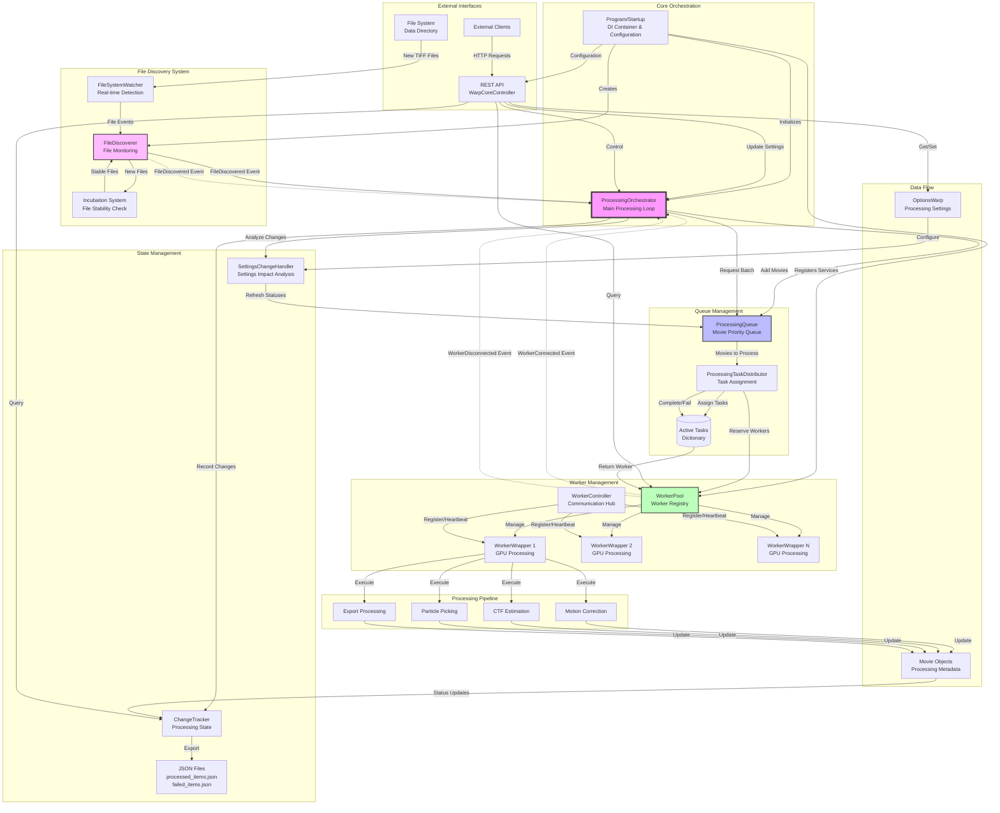

# WarpCore Architecture Documentation

## Overview

WarpCore is a distributed image processing system designed for real-time electron microscopy data processing. The system automatically discovers new movie files as they arrive from the microscope, manages their processing through multiple GPU-equipped workers, and provides a REST API for monitoring and control.

## Architecture Diagram



## Core Components

### 1. ProcessingOrchestrator
**Location**: `WarpCore/Core/ProcessingOrchestrator.cs`

The central coordinator that ties the entire system together. Manages the main processing loop and coordinates between all other components.

**Key Responsibilities:**
- Runs continuous processing loop (2-second intervals)
- Responds to file discovery events
- Manages worker connection/disconnection events  
- Handles settings updates and their impact
- Coordinates task assignment and execution
- Manages stale task cleanup (30-minute timeout)

### 2. FileDiscoverer
**Location**: `WarpCore/Core/FileDiscoverer.cs`

Monitors the data directory for new movie files and ensures they are stable before processing.

**Key Features:**
- Real-time file system monitoring via `FileSystemWatcher`
- File "incubation" system to prevent processing incomplete files
- Supports both recursive and non-recursive directory scanning
- Thread-safe file status tracking
- Configurable incubation period (default: 1 second)

### 3. ProcessingQueue
**Location**: `WarpCore/Core/Processing/ProcessingQueue.cs`

Manages the queue of discovered movies with intelligent prioritization.

**Prioritization Logic:**
1. **Outdated movies** (settings changed, need reprocessing)
2. **Unprocessed movies** (never processed)
3. **Discovery order** (within each priority level)

### 4. ProcessingTaskDistributor  
**Location**: `WarpCore/Core/Processing/ProcessingTaskDistributor.cs`

Handles task assignment to workers and manages the complete task lifecycle.

**Key Features:**
- Atomic worker reservation to prevent double-assignment
- Task progress tracking through processing steps
- Automatic task reassignment when workers disconnect
- Failure handling with movie exclusion
- Comprehensive task cleanup for stale operations

### 5. WorkerPool
**Location**: `WarpCore/Core/WorkerPool.cs`

Manages the pool of distributed GPU workers and coordinates processing execution.

**Worker Management:**
- Thread-safe worker registration and status tracking
- Integration with `WorkerWrapper`'s static controller infrastructure
- Processing step execution (Motion → CTF → Picking → Export)
- Intelligent step determination based on current vs. required processing

### 6. SettingsChangeHandler
**Location**: `WarpCore/Core/Processing/SettingsChangeHandler.cs`

Analyzes the impact of processing settings changes and coordinates system updates.

**Impact Analysis:**
- Compares processing options for each step (CTF, Motion, Picking, Export)
- Detects when processing steps are enabled/disabled
- Triggers immediate work redistribution for significant changes
- Updates movie statuses based on new requirements

### 7. ChangeTracker
**Location**: `WarpCore/Core/ChangeTracker.cs`

Tracks processing state changes and maintains external integration files.

**Outputs:**
- `processed_items.json` - Successfully processed movies
- `failed_items.json` - Failed or excluded movies
- Timestamp tracking for client change detection

## Key Architectural Patterns

### Event-Driven Processing
The system uses events to maintain loose coupling between components:
- `FileDiscovered` events trigger processing initiation
- `WorkerConnected/Disconnected` events trigger work redistribution
- Settings change events trigger queue re-evaluation

### Queue-Based Task Distribution
- Centralized priority queue ensures fair and efficient processing
- Atomic worker reservation prevents race conditions
- Task lifecycle tracking enables robust error handling

### Thread-Safe Operations
All shared state is protected with appropriate locking mechanisms:
- Movie queue operations are serialized
- Worker pool access is thread-safe
- Task assignment is atomic

### Resilient Processing
- Automatic stale task detection and cleanup
- Worker disconnection handling with task reassignment
- File incubation prevents processing incomplete data
- Comprehensive error handling with movie exclusion

## Processing Pipeline

Each movie file goes through a standardized processing pipeline:

### 1. Motion Correction
Corrects for beam-induced motion during image acquisition.

### 2. CTF Estimation  
Estimates the Contrast Transfer Function for image correction.

### 3. Particle Picking
Automatically identifies and extracts particles of interest.

### 4. Export Processing
Generates output files in various formats (averaging, stacking, deconvolution).

**Smart Processing**: Only executes steps that are needed based on:
- Current processing settings vs. previously applied settings
- Enabled/disabled processing steps
- Existing metadata and output files

## Data Flow for On-The-Fly Processing

### 1. File Detection
```
Microscope → TIFF File → FileSystemWatcher → FileDiscoverer → Incubation → FileDiscovered Event
```

### 2. Task Creation
```
ProcessingOrchestrator → ProcessingQueue → ProcessingTaskDistributor → WorkerPool → Task Assignment
```

### 3. Processing Execution
```
WorkerWrapper → Load Stack → Motion Correction → CTF Estimation → Particle Picking → Export → Metadata Update
```

### 4. State Management
```
Processing Completion → ChangeTracker → JSON Export → API Status Updates
```

## Configuration and Control

### REST API Endpoints
**Location**: `WarpCore/Controllers/WarpCoreController.cs`

- **Settings Management**: `GET/PUT /api/settings`
- **Processing Control**: `POST /api/processing/start|pause`
- **Status Monitoring**: `GET /api/processing/status`
- **Worker Management**: `GET /api/workers`
- **Change Tracking**: `GET /api/items/summary|timestamp`
- **Data Export**: `POST /api/export/micrographs|particles`

### Command Line Options
```bash
WarpCore --data /path/to/data --processing /path/to/output --port 5000 --controller-port 8080
```

## Scalability and Performance

### Horizontal Scaling
- Multiple GPU workers can be added dynamically
- Workers automatically register with the controller
- Load balancing through atomic task assignment

### Performance Optimizations
- Parallel task execution across available workers
- Intelligent processing step determination
- Efficient file system monitoring
- Minimal processing overhead through event-driven architecture

### Resource Management
- Worker pool manages GPU resource allocation
- Task timeout handling prevents resource leaks
- Automatic cleanup of stale operations

## Testing Infrastructure

### Unit Tests
**Location**: `WarpCore/Tests/FileDiscovererTests.cs`
- File discovery and incubation validation
- High-volume processing tests (1000+ files)
- Event handling verification

### Integration Tests  
**Location**: `WarpCore/Tests/WarpCoreApiTests.cs`
- Complete API endpoint testing
- End-to-end processing workflow validation
- Isolated test environment with temporary directories

This architecture enables WarpCore to process electron microscopy data in real-time as it arrives from the microscope, providing a robust, scalable, and fault-tolerant distributed processing system.