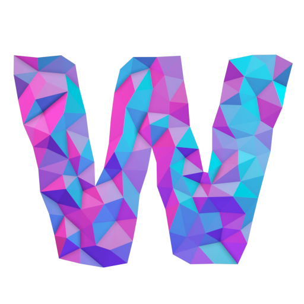

# Warp

<figure markdown="span">
  { width="250" }
  <figcaption></figcaption>
</figure>

- :octicons-stack-24:{ .lg .middle } __Frame Alignment__
- :material-circle-half-full:{ .lg .middle } __Defocus Estimation__
- :material-target:{ .lg .middle } __Particle Picking__
- :material-cube-outline:{ .lg .middle } __Tomography__
- :electric_plug:{ .lg .middle } __Plug it in__
- :octicons-star-16:{ .lg .middle } __Beautiful UI__

Warp integrates algorithms for frame alignment, defocus estimation, particle
picking and tomographic reconstruction in a rich user interface. Thanks to its
on-the-fly processing mode and integration with SPA tools like cryoSPARC and RELION, you
can monitor data quality in real time, analyze data at the microscope, and obtain
high-resolution structures even before you data collection is over.

