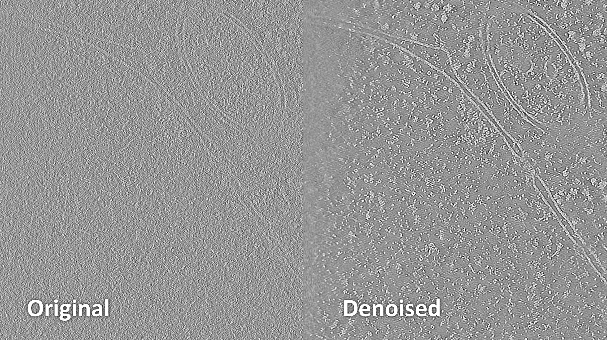

# 3D Denoising with Noise2Map

## Overview

Noise2Map is a command-line tool included in Warp's installation directory for training
a denoising neural network on volumetric data, based on
the [noise2noise principle](https://arxiv.org/abs/1803.04189). It requires adding the
installation directory to your PATH for easier execution.

### System Requirements

- At least two GPUs, or one GPU with a minimum of 16 GB memory.

### Data Types Supported

- Half-map reconstructions from single particle data.
- Tomograms.

## Usage

### Denoising Half-Maps

- **Data Setup**: Place the first map of each pair in one folder (e.g., "odd"), and the
  second in another (e.g., "even"). Ensure file names are identical across folders.
- **Execution**: Use arguments like `--observation1` and `--observation2` to specify
  folder paths.
- **Additional Parameters**:
    - **`--mask`**: Path to a binary mask to help balance training samples.
    - **`--dont_flatten_spectrum`**: Disable amplitude spectrum flattening.
    - **`--overflatten_factor`**: Adjusts the degree of flattening or sharpening.
    - **`--lowpass` and `--angpix`**: Used to set filtering based on resolution and
      pixel size.
- **Training**: Typical training involves 600 iterations but can be adjusted based on
  GPU memory constraints.

### Denoising Tomograms

- **Data Preparation**: Utilize Warp's UI to separate odd/even tilt images and
  potentially pre-deconvolve them.
- **Key Differences in Parameters**:
    - Do not use a mask.
    - Set `--dont_flatten_spectrum`.
    - Typically requires more than 10,000 iterations.

## Output

- Denoised maps are saved in a "denoised" folder. Separate denoising of half-maps can be
  specified.

## Note

- If reusing a model (`--old_model`), ensure that the filtering parameters match those
  used during its training to avoid invalidating the model.

