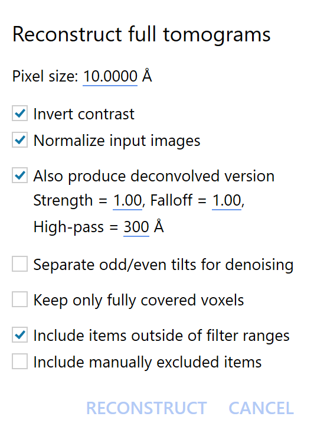
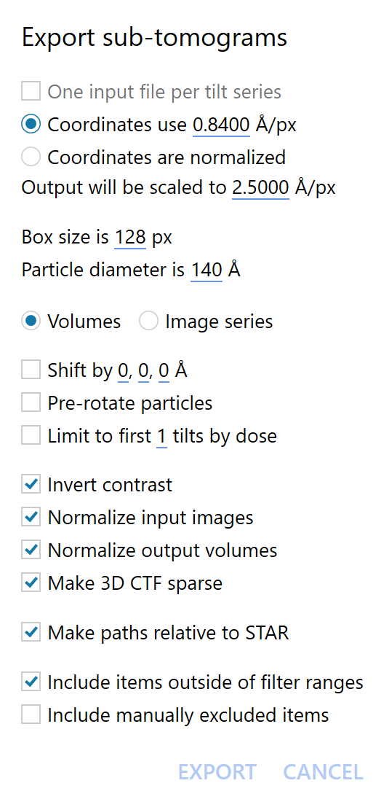

# Tilt Series Task Dialogs

## Reconstruct Full Tomograms



This dialog allows you to reconstruct "full tomograms", i.e., volumes located at the
center of the tilt series with the **Unbinned tomogram dimensions** set previously in
the **Input** settings section. These tomograms can be used for visual inspection and
template matching. **Important**: Unlike other pipelines, where the reconstruction of a
giant, unbinned tomogram is required to extract sub-tomograms at unbinned pixel size
from it, Warp's workflow expects you to use the
dedicated [sub-tomogram reconstruction dialog](#export-sub-tomograms)
to obtain sub-tomograms with an unbinned/very small pixel size. Reconstructing a very
large tomographic volume in Warp will take very long and has a good chance of crashing.

The reconstructed tomograms will be located in the *reconstruction* subfolder, and the
file names will contain the pixel size as a suffix. Tomogram reconstruction will be
skipped for items that already have volumes saved at that pixel size. If you would like
to replace them, please delete the volumes manually from the *reconstruction* subfolder.

- **Pixel size**: The target pixel size to which the tilt series data will be scaled
  prior to reconstruction. It can't be smaller than the size dictated by the **Bin**
  parameter in the **Input** settings section. The maximum resolution achievable with
  the data will be twice the pixel size.
- **Invert contrast**: Multiply the input data by -1 to invert the contrast. Following
  standard conventions, black particles from cryo data will become white if this is
  enabled.
- **Normalize input images**: The scaled tilt images will be normalized to mean = 0,
  standard deviation = 1 prior to reconstruction.
- **Also produce deconvolved version**: In addition to the normal reconstruction, a
  deconvolved version will be made and stored in the *reconstruction/deconv* subfolder.
  The visual effect is [depicted here](https://github.com/dtegunov/tom_deconv). Please
  also refer to that page for parameter description. The defaults are often fine.
- **Separate odd/even tilts for denoising**: In addition to the normal reconstruction, a
  pair of reconstructions from all odd and even tilts will be made and stored in the
  *reconstruction/odd* and *reconstruction/even* subfolders. These pairs can be used
  to [train a 3D denoiser](../noise2map/noise2map.md). If **Also produce
  deconvolved version** is checked, both tomograms will have the same deconvolution
  filter applied to them.
- **Keep only fully covered voxels**: If enabled, voxels in the reconstruction that are
  not covered by all of the tilts due to excessive shifts or rotations will be zeroed
  out. Do not enable this if you intend to perform template matching on the tomograms –
  it will lead to artifacts. The template matching procedure itself will apply a similar
  mask to the result.

## Export Particles

# Export Sub-Tomograms



This dialog allows you to reconstruct "sub-tomograms", i.e., small, cubic volumes
centered around a set of 3D coordinates you provide. The pixel size of these
reconstructions is usually much smaller than the one used
for [full tomogram reconstruction](#reconstruct-full-tomograms) because the
volumes are later aligned on a common target and averaged to obtain better signal. Warp
also reconstructs a 3D CTF volume for each particle to be used in RELION's refinement
procedure.

If you're only starting to incorporate Warp into your tomography pipeline, a few things
can go wrong at this step. The first sanity check to do after sub-tomogram export is to
average all the volumes and hopefully observe a white blob in the middle of the average.
This way you know that the particle positions coincide with the actual particles, as
opposed to being off if something ist wrong. The easiest way to get the average is to
use RELION's `relion_reconstruct` (or `relion_reconstruct_mpi` for the parallelized
version). The command looks something like this:

```shell
relion_reconstruct --i particles_from_warp.star --o rec.mrc --3d_rot --ctf
```

Before you see the actual dialog, Warp will ask you to provide a file with particle
coordinates. Only RELION's STAR format is currently supported. The file must contain at
least the `rlnCoordinateX/Y/Z` columns. If `rlnOriginX/Y/Z` are specified, Warp will
consider them, and the values will be reset to 0 in the STAR file Warp generates. You
can use either a single file for all tilt series or, if you have one file per tilt
series (e.g., after template matching) with names formatted
as `[series name]_suffix.star`, you can point Warp to one of those files and it will
figure out the suffix automatically and find all remaining files in the same folder. In
the second case, **One input file per tilt series** will become checked. If you'd like
to use just the file you selected and reconstruct sub-tomograms from only one tilt
series, you can uncheck it.

**Coordinates use...**: If the coordinates come from RELION, they are in pixels. Because
you might want to switch the pixel size occasionally, Warp handles all coordinates in
Angstrom internally. Thus, you need to specify the pixel size used in that particular
STAR file. It is assumed to be the same for `rlnCoordinateX/Y/Z` and `rlnOriginX/Y/Z`.

**Coordinates are normalized**: If the coordinates come from Warp's template matching,
they are normalized to a range of [0; 1]. Warp will automatically scale them back to the
physical tomogram dimensions if you check this option.

**Output will be scaled to...**: The target pixel size to which the tilt series data
will be scaled prior to reconstruction. It can’t be smaller than the size dictated by
the **Bin** parameter in the **Input** settings section. The maximum resolution
achievable with the data will be twice the pixel size.

**Box size is...**: The sub-tomogram box size in pixels. Warp avoids CTF aliasing by
calculating the necessary minimum box size for the particle's defocus value and the
expected maximum resolution, as dictated by the pixel size, and then crops the volume
back to the value you specified. For high-defocus data and small boxes, this can make
the high-resolution Thon rings invisible. Don't worry, this is fine. In fact, it is much
finer than previous methods that would have made the data useless beyond the
aliasing-free resolution.

**Particle diameter is...**: The particle diameter should be roughly the same you will
use later in RELION, otherwise it might complain about incorrect normalization.

**Volumes / Image series**: In addition to reconstructing 3D sub-tomograms, Warp can
also generate a series of 2D tilt images for each particle. There is currently no use
for this data type in RELION, unless you have giant particles with a lot of signal and
would like to refine the particle tilt images completely independently like in EMAN 2.3.
This is probably not a good idea.

**Shift by...**: You can shift all particle positions by the same amount in 3D. If the
input STAR file contains refined particle orientations (`rlnAngleRot/Tilt/Psi` columns),
the shift will be made in the refined map's reference frame. Use this if you have
aligned all particles on a common part of the protein, and want to e.g. shift the map
center to a ligand to analyze it further. Note that the shift values are in Angstrom.

**Pre-rotate particles**: If refined particle orientations (`rlnAngleRot/Tilt/Psi`
columns) are available, the reconstructions can be pre-rotated to their common reference
frame. If you were to average the resulting sub-tomograms without considering any
rotations (e.g. simply sum them up in Matlab), you would get the refined map. This can
be useful if you're developing a new method to analyze the particles (e.g. variance, 3D
PCA etc.) and don't want to bother with particle orientations. The 3D CTFs will be
pre-rotated to the same reference frame, too.

**Limit to first N tilts by dose**: The reconstructions or particle tilt series will
contain only data from the first N tilts, sorted by dose. This can be useful if you
think the late tilts don't contain any information that might help your analysis.

**Invert contrast**: Multiply the input data by -1 to invert the contrast. Following
standard conventions, black particles from cryo data will become white if this is
enabled.

**Normalize input images**: The scaled tilt images will be normalized to mean = 0,
standard deviation = 1 prior to reconstruction.

**Normalize output volumes**: Normalizes the reconstructions so that the volume outside
the specified particle diameter is mean = 0, standard deviation = 1. This is required
for RELION.

**Make 3D CTF sparse**: Don't use this just yet! It requires a patch for RELION that
isn't public yet. If enabled, every voxel of the 3D CTF with a value below 0.01 will be
explicitly set to 0. This allows the patched RELION algorithms to completely exclude
them from calculations, saving a lot of time.

**Make paths relative to STAR**: Paths to the reconstructed volumes and 3D CTFs will be
made relative to wherever you choose to save the output STAR file. Usually a good idea.

After clicking **Export**, Warp will ask you to specify the name and location of the
output STAR file that will contain the paths of all volumes and their metadata. Use this
file as input for RELION.
