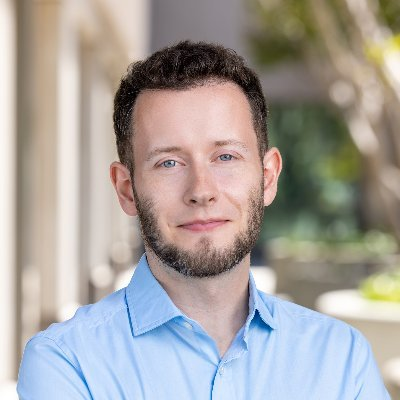
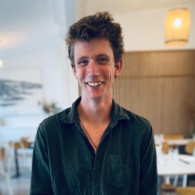

# Team

-  
Dimitry Tegunov

-  
Alister Burt

Dimitry leads a research group at Genentech in the San Francisco Bay Area.
He wrote *Warp*, *M* and friends during his PhD in Patrick Cramer's lab at the
Max Planck Institute for Biophysical Chemistry in Göttingen, Germany.

Dimitry was joined at Genentech by Alister in late 2023. Alister was an early adopter of
the Warp/M ecosystem who now helps out with development.

