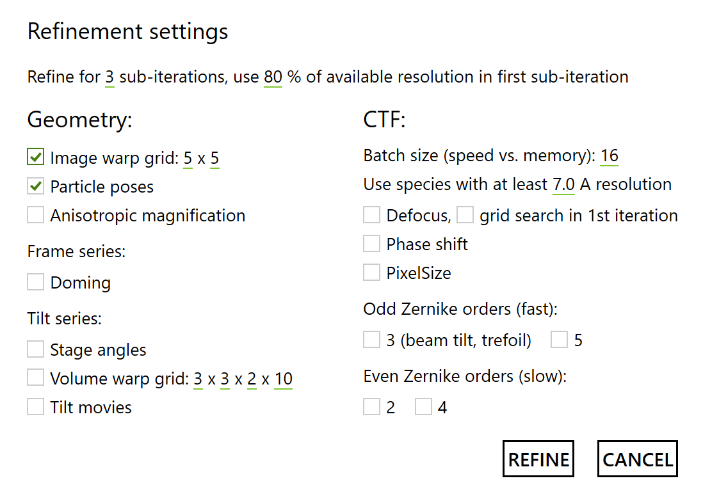

# Quick Start: M

<figure markdown="span">
  { width="250" }
  <figcaption></figcaption>
</figure>

M is a stand-alone program shipped with Warp. While Warp handles the first stages of the
data processing pipeline, M lives on its opposite end. It allows you to take refinement
results from RELION and perform a multi-particle refinement. For frame series data, the
procedure is similar to RELION's "particle polishing" and probably won't deliver
significantly better results – unless you have a very heterogeneous dataset that can
benefit from M's ability to consider as many classes as you want (memory limitations
apply!), or maps with heterogeneous resolution that can benefit from M's map denoising.
For tilt series data, M will likely deliver a noticeable resolution boost compared to
patch tracking- or fiducials-based tilt alignments. Refinement of *in situ* data will
also benefit significantly from the unlimited number of classes and transparent
mechanisms for combining data from different sources.

## The pipeline

Pre-processing of [frame series](../warp/quick_start_warp_frame_series.md)
or [tilt series](../warp/quick_start_warp_tilt_series.md) in Warp  
↓  
Particle [image](../warp/task_dialogs_frame_series.md)
or [sub-tomogram export](../warp/task_dialogs_tilt_series.md#export-sub-tomograms) from Warp  
↓  
[Classification and refinement in RELION](https://www3.mrc-lmb.cam.ac.uk/relion/index.php/Main_Page)  
↓  
Import and refinement in M  
↓  
Final maps

(optionally: → re-export improved particles from Warp → re-classify and refine in
RELION → import and improve alignments in M → repeat as needed)

## Project structure

M strives to be a great tool for *in situ* data, which have been compared
to "[molecular sociology](https://science.sciencemag.org/content/351/6276/969)". Thus,
its terminology takes a somewhat sociological angle. A project in M is referred to as a
**Population**. A population contains at least one data source and at least one species.
A **Data source** contains a set of frame series or tilt series and their metadata. A *
*Species** is a map that is refined, as well as particle metadata for the available data
sources.

## Creating a population

When M starts, you can choose between creating a new population and opening an existing
one. To create a new population, give it a name and specify its root folder. There are
no particular requirements for this location. It won't experience much IO during
refinement, and the species folders contained there might grow to a few tens of
gigabytes depending on map size. For populations with a single data source, we usually
just go one level above the old Warp project folder.

## Adding data sources

Once a population is open, you can click on the data source summary saying "0 data
sources" to open the management dialog. Remote data sources are not supported at the
moment. Click **Add local** and select a **.settings** file in a Warp project folder.
Once M converts that file into a data source, its parameters and list of items become
read-only. So if you want to change something (e.g. quality filter settings or binning
value), load the folder in Warp and modify the settings. M will read in the metadata for
all items and present you with the number of items that pass all quality criteria, as
well as those filtered out or deselected manually. Give the data source a name, choose
whether to include the sub-optimal items, and set the **maximum number of frames or
tilts** (sorted by dose). The latter can be useful if the data have a very high overall
dose that was used for picking or visual interpretation, but isn't required for
high-resolution alignment – this will save computational resources during M's
refinement. You can't change this setting later. Finally, click **Create**. The list of
data sources should now contain the new source with its input settings.

## Adding species

Make sure you've added all data sources you'd like to use, and click the big **+** to
initiate the creation of a new species. Remote species aren't supported yet, but you can
create a local one from scratch. Select **From scratch** and click **add**.

Give the species a **Name** and specify its **Diameter** along the longest axis. This
value will determine the box size (2x diameter) and the spherical mask diameter for some
operations. The **Molecular weight** currently isn't used anywhere, but you can specify
a value anyway in case some smart heuristics become available in a future M version to
take advantage of it. The **Symmetry** follows RELION's conventions. Select the correct
group and a multiplier if applicable. The number of **Temporal samples for poses**
determines how finely per-particle translation and rotation trajectories will be
resolved as a function of dose. The optimal value depends on the particle mass (bigger =
more signal = can fit more parameters) and the overall dose. Frame series data with a
relatively low dose can benefit from 2–3 sampling points (2 still works for a 150 kDa
protein), while 100+ e/Å2 tilt series can use 3–4 (especially when dealing with
particles as large as ribosomes). If you intend to classify the particles further after
an initial M refinement, you may want to set the number of temporal samples to 1 to
definitely avoid biasing the classification through overfitting on a single reference.

For the **Half-maps**, it is best to select the final, unfiltered half-maps from
RELION's 3D refinement. If you performed the refinement with binned data, please rescale
the maps first to the pixel size you'd like to use in M, e.g. using the
relion_image_handler utility. Once the first half-map is selected, M should figure out
the **Pixel size** based on its header. If not, specify the value manually. The
interactive isosurface renderings are there to help you make sure the selected half-maps
are what you think they are.

The **Mask** can be loaded from a volume you made using the relion_mask_create utility,
or prepared in M by low-pass filtering the average of the half-maps and selecting a
binarization threshold. For refinements, M will expand and smooth the mask based on the
current refinement resolution. Thus, the mask you provide should be binary (no
smoothing) and as tight as what you would get in RELION before the expansion and
smoothing steps. The pixel size and dimensions should be the same as those of the
half-maps.

To use refined **Particle** positions and orientations from RELION, select a *_data.star
file from the Refine3D job. M should be able to figure out the correct pixel sizes for
both coordinates and shifts. Please correct the values manually if you think they are
wrong. Deselect any data sources you don't want the particles to be linked to (e.g. in
case of identical file names in multiple sources). If you have repeating file names
across several data sources, please add the particles for one of them and use the
particle set operations to add more later. M will report the number of particles that
have been successfully linked to the data. If that number is 0 or lower than it should
be, mismatching file names are the most likely culprit. Make sure the names in the
rlnMicrographName column of the data.star file don't have any extra parts compared to
the file names in the data source. For tilt series, rlnMicrographName should reference
the .tomostar files.

Once everything is specified correctly, click **Finish**. M will calculate some map
statistics and train an initial denoising model, which might take 10–15 minutes
depending on your hardware.

## Setting up refinement

With all data sources and species set up, click the big **Refine** button to bring up
the refinement dialog. Here you can select different groups of parameters to be
optimized.

**Refine for N sub-iterations**: During each refinement iterations, M alternates between
refining various sets of parameters. To accelerate convergence, this can be done for
several sub-iterations, which will all use the same reference maps for the optimization.
If you're refining only one set of parameters (e.g. particle orientations), you can set
the value to 1. Otherwise, 2–3 makes sense.

**Use N % of available resolution in first sub-iteration**: M performs a gradient
descent optimization, which can easily get stuck in local optima. To avoid this, the
resolution can be decreased in the beginning and gradually increased until the final
sub-iteration. This can be especially useful for the first refinement iteration on a new
data source. Also, when changing the image or volume warp grid resolution, you should
start with lower refinement resolution (see section below). If only 1 sub-iteration is
to be performed, it starts with 100 % of the available resolution.

### Geometry

**Image warp**: This models the non-linear 2D deformation in each frame or tilt image
due to beam-induced motion and charging. The model is set in the image reference frame,
so if you have rectangular 6000x4000 px K3 images, a 6x4 grid might be more favorable
than 4x4. The temporal dimension of the model equals the number of frames or tilts. For
frame series, a pyramid of models will be created where each subsequent model has 2x the
spatial dimension of the previous one, and 0.25x the temporal dimension. So even if you
start with a 1x1 model, the resulting pyramid will still model some slow spatial
deformation. Tilt series don't get pyramids (although including volume warp or tilt
movie refinement has a similar effect, see below). For both frame and tilt series, the
optimal spatial resolution will depend on the number of particles per micrograph, as
well as the signal available per particle.

**Anisotropic magnification**: Some microscopes can exhibit significant linear
distortion. This option enables its refinement based only on geometry (i.e. not taking
its effect on the CTF into account). At the end of the iteration, the CTF is also
adjusted accordingly. Because anisotropic magnification can be partially fitted with
astigmatism in the CTF, defocus refinement (which includes astigmatism) is recommended
in the same iteration.

**Doming** (frame series only):

**Stage angles** (tilt series only): Due to mechanical imprecisions in the stage's
movement and lack of rigidity in lamella-like samples, the sample orientation can
deviate significantly from their assumed values. While the biggest effect is in the
projected particle positions, which are implicitly taken care of by the image warp
model (at least 2x2 spatial resolution is required there), large particles can benefit
from additional refinement of the sample/stage orientations. The temporal resolution of
this model is per-tilt.

**Volume warp** (tilt series only): Tilt series are often used for thick samples where
multiple particles can overlap along the projection axis. If the sample experiences
shearing perpendicular to the projection axis, layers of particles can be displaced in a
way that can't be modeled by mere 2D deformation of the images. Instead, a warping model
in the reference frame of the tomographic volume is needed to influence particle
positions in 3D. The resulting model has 4 dimensions: 3 spatial and 1 temporal (as a
function of dose). The motion can usually be modeled with sparser temporal resolution
since all the fast per-tilt movement is already taken care by the image warp model.
Having a spatial Z dimension of at least 2 is necessary to model shearing. As with image
warp, the optimal resolution depends on the available overall signal. However, it
doesn't need to be as fine as image warp. Something like 2x2x2x10 might suffice. If your
images are rectangular and you want the model to reflect that, remember that this is the
tomogram reference frame where the tilt axis is aligned with the Y axis. It means that
6000x4000 px images with a tilt axis angle close to 90° or 270° will need e.g. a 2x3
model.

**Tilt movies** (tilt series only): If you used Warp in all of the pre-processing steps,
M can go back all the way to the original tilt movies and optimize their frame alignment
using the same high-resolution references. This procedure usually takes a significant
amount of time. Once the refinement of a tilt movie is finished, an average tilt image
will be saved in the *average* subfolder of the old Warp project directory, overwriting
Warp's previous result. Please note that M currently doesn't back up the previous
version. If something goes wrong and you'd like to go back, please either back up the
old images and movie metadata manually, or re-process the tilt movies with Warp.

**Particle positions/angles**: This is the conventional particle pose optimization,
except you're also fitting rotation and translation tracks if you set the species'
temporal resolution to be higher than 1.

### CTF

**Batch size**: M pre-multiplies the particles by their CTF before cropping them to a
smaller box for refinement. This has no speed disadvantages for geometry refinement.
However, since the CTF must change during CTF refinement, the particles must be
constantly re-extracted, pre-multiplied and cropped – which is computationally
expensive. This is done in mini-batches to keep the memory footprint small. Decrease the
batch size if you run out of GPU memory. Increase it if you have plenty of GPU memory to
gain a bit of speed, but probably not more than half of the average per-series particle
count.

**Use species with at least N Å resolution**: Reference-based CTF refinement requires
relatively high resolution to be successful. If you have multiple species with different
resolution, this parameter determines which of them will be considered during CTF
refinement. For tilt series, the minimum resolution can be a bit lower, e.g. 7 A,
whereas frame series with small particles require higher resolution, e.g. 4 A.

**Defocus**: For frame series, defocus refinement establishes per-particle defocus
values, and per-series astigmatism with a spatial resolution of 3x3. For tilt series,
defocus refinement finds per-tilt defocus and astigmatism values.

**Grid search in 1st iteration**: Gradient descent optimization will fail when the
defocus is too far off because of the oscillating nature of the CTF. Instead, a broader,
exhaustive search can be performed in the first sub-iteration.

**Phase shift**: If you acquired the data with a Volta phase plate, the phase shift of
the CTF will likely be different in each micrograph. Enable this to optimize a single
phase shift value for each frame series, or a per-tilt phase shift model for each tilt
series.

**Pixel size**: The effect of the pixel size on the CTF is correlated with that of Cs
and acceleration voltage. Thus, given that we don't have very accurate absolute values
for either of those, we can't arrive at the correct absolute pixel size by refining the
CTF model against the data. However, to make the CTF fit better, it is enough to adjust
either of the variables relatively to its assumed value. M can refine per-series Cs as a
substitute for the pixel size. Because the CTF model changes during this refinement, it
is quite slow.

**Odd Zernike orders**: Zernike polynomials of odd orders describe anti-symmetric
aberrations. They don't affect the CTF and can thus be refined quickly together with the
geometry. 3rd-order polynomials model beam tilt and trefoil. Probably doesn't make sense
at resolutions worse than 4 A, unless the microscope is very poorly aligned.

**Even Zernike orders**: Zernike polynomials of even orders affect the CTF and are thus
quite slow to refine in M. The refinement is done per-series, so you need a high
particle density to get enough signal. This will be handled in a smarter way in the
future.

**CTF refinement**: Once your species reach a high enough resolution, you can refine
parameters of the contrast transfer function. A resolution of at least 6–7 A is
recommended for this. Since not all species may reach the same high resolution, you can
specify a threshold to **Use species with at least x A resolution**.

**Defocus and astigmatism**: For frame series, this will refine the defocus values
per-particle, as well as one common set of astigmatism parameters. In tilt series, the
relative Z offsets between particles are known with a higher precision than could be
obtained through defocus refinement. However, defocus and astigmatism can change in each
tilt. M optimizes a global defocus offset and astigmatism per-tilt in that case.

## Changing model resolution between refinement iterations

M performs a gradient descent-like optimization to cope with the multitude of parameters
in a multi-particle refinement. This means that it is much more likely to get stuck in a
local optimum if the global optimum is too far away. Starting refinement using RELION's
globally refined poses and at relatively low resolution helps with that. However, if you
decide to change the resolution of the image or volume warp models, resampling the model
can put some parameters too far away from their optima for the latter to be reached. You
should at least set the refinement resolution to be lower in the first sub-iteration,
e.g. 70 %. It can also be helpful to ignore the results obtained with the previous
models and just restart refinement from the very first iteration. To do so, overwrite
the frame or tilt series metadata (located in the same folder as the raw data) as well
as the species files with their first versions. The latter can be found in the
*versions* subfolder of the respective data source and species directories. You can also
do this with any other previous version if you want. Sorry for the inconvenience – M's
UI will offer a better mechanism in the future.

## Memory considerations

Because M needs to hold all particle images in memory at the same time when refining a
frame or tilt series, the memory footprint can become quite large if you have a lot of
particles per item and/or high resolution. To address this, M stores these images in "
pinned" CPU memory, which the GPU can directly access. Unfortunately, the actual
available amount of pinned memory is usually far lower than the overall memory capacity,
and the exact amount is still a bit of a mystery to us. For instance, on a system with
128 GB RAM, ca. 20 GB can be used as pinned memory by M in our experience. On multi-GPU
systems, M will schedule the processing of individual items such that the simultaneous
pressure on pinned memory does not exceed an empirically determined limit. This can lead
to some GPUs staying idle temporarily while there is not enough memory. If a single item
requires more memory than the limit, M will try to process it anyway and may crash. If
there are only a few of such densely populated items and they are not critical to the
overall project, you can try removing them from the data source's .source file.

Meanwhile, GPU memory is used to store reference volumes for all species, the raw frame
or tilt data, as well as buffers and FFT plans for fast pre-processing of small batches
of particle images. Reconstruction volumes are loaded into GPU memory one species at a
time at the end of an item's refinement, and transferred back to (unpinned) CPU memory
once back-projection is finished. Unless you have lots of high-resolution species, cards
with 12 GB of memory should be fine.

We are working on making use of free GPU memory as a substitute for some of the pinned
CPU memory. However, multi-particle refinements will likely remain resource-intensive in
the near future.

## Making sense of the results

All refined species maps are contained in the *species/[species ID]* subfolders inside
the population directory. The species IDs are very cryptic to make them unique
regardless of the names, but the maps include the species name you provided. The most
useful maps are likely the two *half1* and *half2* half-maps, the filtered and sharpened
*filtsharp* map (equivalent to the output from RELION's post-processing), the *denoised*
map, as well as the local resolution values contained in the *localres* volume. The
current global resolution and B-factor used for sharpening are contained in the
*.species* XML file.

If the resolution of your map has far surpassed that of the map you used to prepare the
initial mask and you think the latter looks too blobby, you can use e.g. M's denoised
map to prepare a new mask using relion_mask_create, and sneak that updated mask into the
next refinement iteration by replacing the *[species name]_mask.mrc* file with it.
Please make sure it has the same pixel size as the rest of that species' maps.
