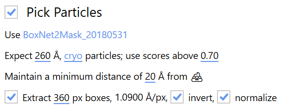

# Using Warp with BoxNet

Warp employs **BoxNet**, a deep convolutional neural network, for particle picking and
maintains a central database of training data that any user can contribute to. As new
examples are added, the BoxNet model is constantly re-trained using all available data.
In addition to this, BoxNet can be re-trained locally on any data you would like to pick
more specifically. Thus, while the concept of sample-specific templates does not exist
with BoxNet, you can maintain multiple pre-trained models for different samples. More
information on how to re-train BoxNet can be
found [here](./retraining.md).

Click **Select BoxNet model...** to open a list of available models. All models
contained in `WarpInstallationDirectory/boxnet2models/*` are enumerated here. If you
just installed Warp recently, the list of official BoxNet models pre-trained only on the
public dataset should be up-to-date. If your installation is a bit older, click **Browse
Public Repository** to download the latest versions. After downloading new models,
please re-open the model selection window to see the changes. Once a model is selected,
click **Use** (
or [follow the re-training guide](./retraining.md).

There are **2 types** of official BoxNet models: One follows the *BoxNet2_\** naming
scheme and can only distinguish between background and particles. Another is called *
BoxNet2Mask_\** and can distinguish between background, particles, and high-contrast
artifacts, e.g., ethane drops. Knowing the exact location of such artifacts allows to
dismiss particles located too close to them.

The **Diameter** setting controls how close two particles can be together before the
particle with lower probability is dismissed from the picks. The **Data Type**
determines whether the sign of the data is flipped before picking (negative stain), or
not (cryo). A **Minimum Score** threshold is applied to BoxNet’s predictions. When using
a model specifically pre-trained on the current protein species, the score can be
typically left at its default value of 0.95. Picking new species with the generic
version can sometimes require lower threshold values to pick up everything.

If you’re using a BoxNet version that can create masks, you can enforce a **Minimum
Distance** between particles borders (as defined by their diameter) and 💩.

The picked particles can be **extracted immediately** after the picking, which is
especially useful for real-time processing. For that, the **Box Size** must be set – ca.
150% of the particle diameter is recommended to avoid interpolation artifacts later. The
pixel size is fixed to that used for the entire pre-processing pipeline. If you want to
extract particles with a different pixel size, you can do so later using one of
the [Task Dialogs](../../../reference/warp/task_dialogs_frame_series.md). Cryo data need to be
**inverted** upon extraction. For SPA packages that require particles to be
pre-normalized, e.g., RELION, the diameter used for picking will also be used for *
*background normalization**.
