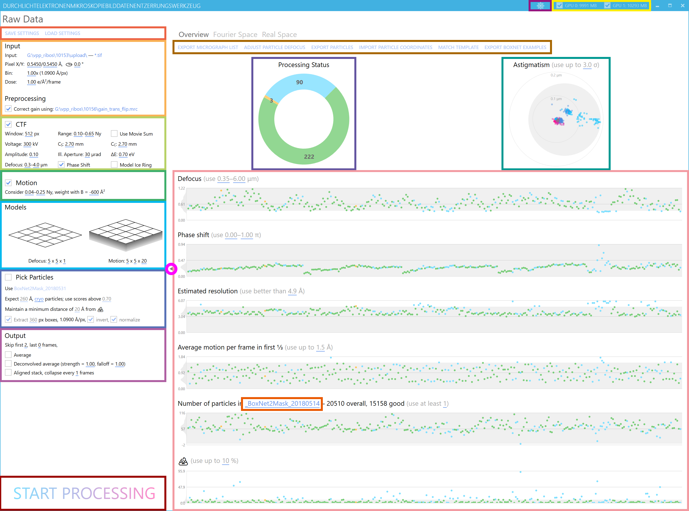
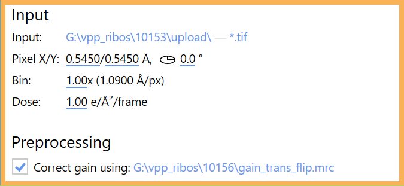
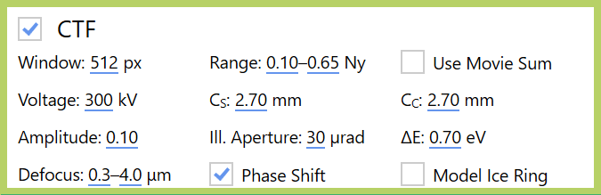
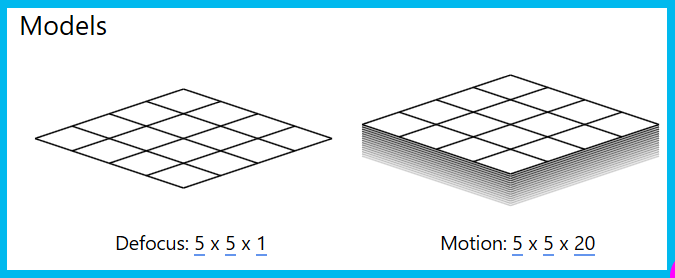
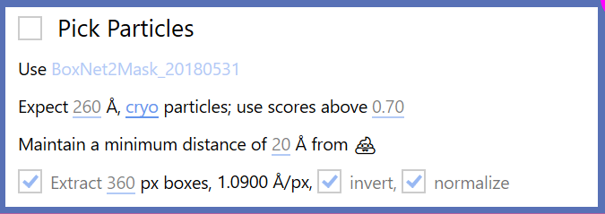
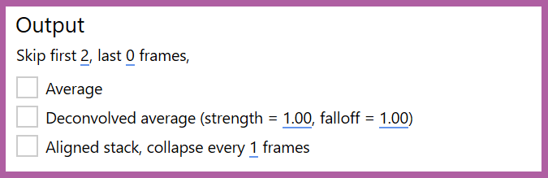
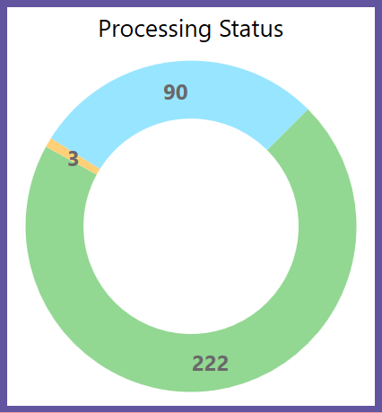
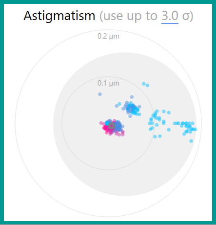
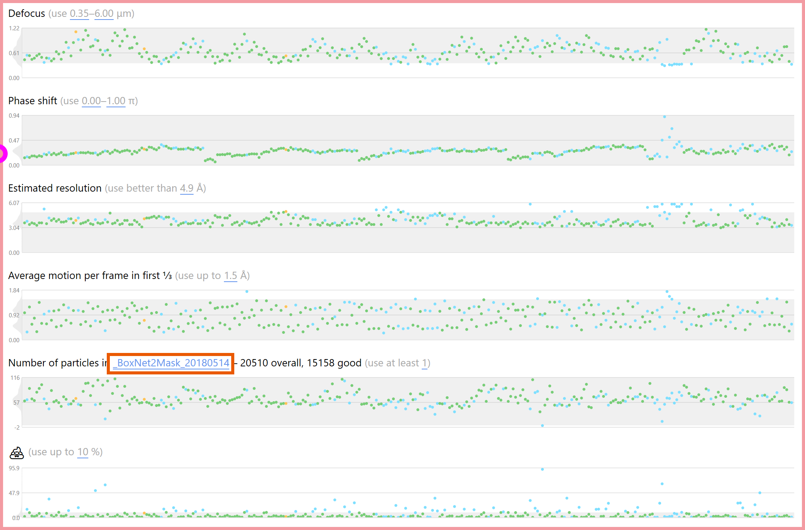

## Interface Overview

Switch between the light and dark UI themes.

---

All available GPUs are listed here, together with their free memory capacity. The checkboxes can be unticked to exclude specific GPUs from processing.

---

Warp automatically saves the latest set of processing settings used for a folder. These buttons allow saving and loading a permanent copy of the settings. Warp will also offer to load a folder's auto-saved settings when switching to that folder in the input options.

## Input Folder

The input folder contains all the files that should be processed. Warp will not look for files recursively in sub-folders, so all files must be located on the top level. Several file formats are supported: MRC, EM (from the TOM Toolbox), header-less (anything binary with a fixed header length), and Warp's own TomoSTAR for tilt series definition. If you're working with a header-less format (or any format Warp doesn't recognize yet), select the DAT option, and specify the frame dimensions, data type, and an optional offset at the beginning of the files. Only the *.dat extension is supported for the file names, but you can use any header-less format by renaming them. Warp's interface switches to tomography mode if TomoSTAR is selected as the input format.

The pixel size in the X and Y dimensions refers to the raw, unbinned data. If you haven't determined the magnification anisotropy for your microscope, both numbers will be the same. The anisotropy angle specifies the anti-clockwise rotation of this X/Y coordinate system. The anisotropy will be considered for CTF fitting and corrected (i.e., equalized) in the exported particles and full tomogram reconstructions. However, whole-micrograph averages remain uncorrected, so particle positions don't need to be rescaled when you decide to change the anisotropy parameters.

The binning factor can assume any positive rational values. The frames will be Fourier-cropped to Size / 2^n.

If you enter any non-zero electron dose value, frames will be weighted in all operations that produce averages, e.g., aligned movie or particle averages. The weighting is implemented as a B-factor of -3*Dose Å^2. Please don't forget to convert the dose value to the correct units.

The raw data can be multiplied by a gain reference to correct for systematic errors in pixel intensities. Please make sure the gain reference matches the data. Warp will tell you if the dimensions don't match, but it can't detect if the reference is flipped in X or Y. For instance, older Digital Micrograph versions flip the output in Y when converting a DM4 gain reference to MRC.

---

## CTF Settings

The Window specifies the size of the power spectrum. If you expect only low defocus values or need highly localized defocus values, leave the window small, e.g., 512 px.

The Range specifies the spatial frequencies used for fitting. It is usually best to ignore the lowest frequencies. If you specify a defocus model without spatial resolution (see the next section), you can set the maximum range to 1.0. If you are fitting a highly resolved model, keep the maximum value lower to prevent overfitting.

In some cases (e.g., very low dose images), the fitting will work better if the power spectrum is created from the aligned movie average instead of the per-frame power spectra – check Use Movie Sum to do that.

The Voltage and C_S (spherical aberration) values are specific to your microscope model. A Titan Krios is usually operated at 300 kV, and C_S is 2.7 mm in most modes.

The C_C (chromatic aberration), Illumination Aperture, and ΔE (energy spread) values are currently not used but might become relevant in future versions of Warp. Just leave the defaults for now – we'll figure out what to do with them later!

The Amplitude value defines the fraction of amplitude contrast in the CTF. Commonly used values for cryo data are 0.07 and 0.10, while negative stain data are often fitted with 0.20.

The Defocus spread defines the range of defocus values for the initial exhaustive search. Set both values to match the range specified in your acquisition software with a bit of a margin.

When dealing with data acquired with a phase plate, check Phase Shift to fit that parameter as well.

Mode Ice Ring is currently an experimental feature that will attempt to model the CTF around the 3.6 Å amorphous ice ring separately from the rest of the power spectrum.

## Motion Estimation

Global and local motion estimation will consider the specified range of spatial frequencies and weight their importance according to the B-factor. The default range of 0.05–0.25 is usually ok for data with 1.00–1.35 Å/px. For larger pixels, consider increasing the range, and vice versa. The more negative the B-factor, the less the higher spatial frequencies will be considered.

---

## Models

**Defocus:** The first two values define the spatial resolution, i.e., how locally the defocus will be estimated (the value at each particle's position is later interpolated based on the values in that coarse model). 5×5 is usually a good value for a 4K micrograph at 1.0–1.3 Å/px. Higher values could make sense for larger pixels, and lower values for smaller pixels. The third parameter defines the temporal resolution. This allows changes in defocus and phase shift to be modeled over the duration of a single movie. Please note that a temporal resolution higher than 1 leads to a vastly increased memory footprint during processing, while probably not improving the final resolution in most cases.

**Motion:** As with the CTF model, the first two parameters for the motion model describe the spatial resolution, and the third describes the temporal resolution. The spatial resolution will be considered in fitting the local beam-induced motion, while the full specified temporal resolution will be used for fitting the global motion. The temporal resolution can usually match the number of frames in the movies. However, if the movies are acquired at an unusually low dose rate, i.e., far less than 1 e/px/frame, you can set the temporal resolution to approximately match the overall electron dose per pixel.

---

## Picking

Clicking Select BoxNet model... or the currently selected model's name will open a dialog with a list of all available models, and buttons to either use one of them, or retrain it with your own data. User guide pages about using and retraining BoxNet models will provide you with more details.

The Diameter setting controls how close two particles can be together before the particle with lower probability is dismissed from the picks. The Data Type determines whether the sign of the data is flipped before picking (negative stain), or not (cryo). A Minimum Score threshold is applied to BoxNet's predictions. When using a model specifically pre-trained on the current protein species, the score can be typically left at its default value of 0.95. Picking new species with the generic version can sometimes require lower threshold values to pick up everything.

If you're using a BoxNet version that can create masks, you can enforce a Minimum Distance between particles borders (as defined by their diameter) and 💩.

The picked particles can be extracted immediately after the picking, which is especially useful for real-time processing. For that, the Box Size must be set – ca. 150 % of the particle diameter is recommended to avoid interpolation artifacts later. The pixel size is fixed to that used for the entire pre-processing pipeline. If you want to extract particles with a different pixel size, you can do so later using one of the Task Dialogs. Cryo data need to be inverted upon extraction. For SPA packages that require particles to be pre-normalized, e.g., RELION, the diameter used for picking will also be used for background normalization.

---

## Output

The first few frames in a movie suffer especially badly from beam-induced motion and can usually be discarded by adjusting the output frame range. This setting will also be respected in all other operations that deal with frames, e.g., particle extraction.

In addition to extracted particles, there are 3 output types for 2D movies:

**Average:** You will almost always want to produce an average in order to inspect the micrographs visually. You can also use other tools to extract particles from them if you don't want to use Warp for that.

**Deconvolved Average:** The same deconvolved version of the average you can see live in the Real Space tab, written out as an MRC file. This can be useful for inspecting the micrographs with better contrast in other tools, but is usually not needed if you only want to screen the data in Warp. Please note that despite the seemingly better contrast, operations like particle picking won't work better on the deconvolved images.

**Aligned Stack:** Some workflows – RELION's particle polishing in particular – rely on pre-aligned movies as input. Please note that aligned movies are very large and will create significant storage and processing overhead. To save some space, you can collapse groups of consecutive frames into one.

## Processing Mode

Clicking **Start Processing** puts Warp into processing mode. This mode remains active until **Stop Processing** is clicked. Editing any processing settings and launching task dialogs is disabled while in processing mode, but viewing and editing processing results (e.g., particle positions) is enabled.

Warp will go through all items in need of processing sequentially (sorted alphabetically) and perform the currently selected processing steps. If processing results are already available for some steps (e.g., CTF or motion) and their settings match the current ones, the processing will not be repeated for those specific steps to save time. However, some processing steps depend on the results of other steps. For instance, particle picking depends on frame alignment because it uses the average. If frame alignment is reprocessed, particle picking will be performed again subsequently.

---

## Settings Collapse

This button lets you collapse the settings panel to make more room for the results. With the settings collapsed, there is enough space to display Fourier and Real Space results side by side on a large screen, so both tabs will be merged.

---

In addition to on-the-fly processing, Warp offers several offline tasks that can be performed once the processing is finished. Most of the tasks are related to importing and exporting data from/to [RELION](https://github.com/3dem/relion/) and compatible packages. Each task is explained in a detailed user guide page.

---

## Plot Status

As movies are processed, they change their status. Every movie is initially marked as **unprocessed**. Once it has passed through the entire pipeline, it is considered **processed**. If you change any processing settings, previously processed items will be marked as **outdated**, i.e., in need of reprocessing. If a processed item's quality criteria don't match the current filter thresholds (see section below), it is labeled **filtered out**. Finally, if you deselect an item manually in the navigation bar, it will be colored as **deselected**.

## Astigmatism Plot

The **astigmatism plot** shows each movie's fitted astigmatism in a 2D coordinate system. The coordinates are computed as `X = cos(2 * angle) * magnitude, Y = sin(2 * angle) * magnitude`. This means the circumference of the depicted circle is only 180° (the fitted angles are only unique within 0–180°). The color reflects an item's coordinate on the time axis, going from old to new.

Unlike the other filters, the astigmatism filter considers the distance of a movie's astigmatism to the entire dataset's mean astigmatism, normalized by its standard deviation. Thus, whenever an item's astigmatism value changes, the entire filter is re-evaluated without an explicit change in the threshold.

---

As soon as an item is processed, its key parameters are added to or updated in the plots: Defocus, astigmatism, phase shift, estimated resolution, average intra-frame motion, number of particles, and the percentage of masked micrograph area. Some of the parameters are likely correlated with the data quality. Using the sliders above the plots in the Overview tab, you can define **Filter Thresholds** for all of them.

As you change a filter threshold, processed items above and below the threshold will change their status between processed and filtered out. Filtered out items can be excluded from all tasks. During on-the-fly processing with particle picking enabled, items that pass all filters are maintained in a separate goodparticles_BoxNetName.star file.

---

## Particle Count Filter

The particle count filter has a special additional parameter: the particle file suffix. All particle coordinates are stored as per-movie STAR files in `[Input Folder]/matching`. Multiple files can be associated with the same movie by using different suffixes. When a movie is added to Warp's list, it automatically finds all available suffixes for that item. The suffix menu contains the superset of all available suffixes of all items. If you manually add STAR files to the matching folder, you need to restart Warp so it can find the new files.

The filter can only consider one suffix at a time. Please note that the suffix doesn't update automatically if you start re-picking the data with a different BoxNet model. The suffix list will contain the new BoxNet's name once at least one micrograph has been picked.
