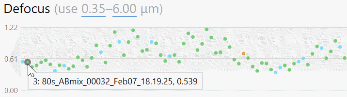

# Quick Start: Frame Series

This quick introduction can help you start processing frame series data (2D movies) with
Warp right away, without diving into details.

## To the microscopes, ready, go!

Load your favorite sample into the microscope and start collecting data. For counting
data from K2/3 and Falcon III detectors, we highly recommend saving the movies as
gain-uncorrected, compressed TIFF files. This will make sure a typical SPA movie with 40
frames doesn't take up more than 200 MB and you don't need to purchase a new file server
every now and then. If you're using SerialEM or other software with native TIFF support,
this can be done with a few clicks. If you're using
EPU, [our Stacker v2 tool](https://github.com/dtegunov/stacker2) will help you.

If you don't have access to a microscope right now, grab a data set
from [EMPIAR](http://www.ebi.ac.uk/pdbe/emdb/empiar/),
e.g. [10153](https://www.ebi.ac.uk/pdbe/emdb/empiar/entry/10153/). This tutorial will
use EMPIAR-10153 for all of its screenshots.

## Launch Warp and get comfortable

Once a steady influx of movies is ensured, you can launch Warp. Just go to the
installation directory and execute **Warp.exe**. The first launch can take a bit
longer – please be patient.

If you don't see the **settings panel** on the left side, click the small triangle to
expand it. Collapsing the settings panel will merge the **Fourier** and **Real Space
tabs** – you may find this mode more convenient for manually screening the processing
results.

If you're a vampire, click the 🔄 button in the window bar to change to a dark UI theme.
We won't judge 🧛

## Setup

### Input parameters

First, you need to tell Warp where to look for data, and what basic input parameters to
expect. These settings are located in the left part of the window under **Input**.

Click **Select folder…** and select the location of your movies. Warp will not look for
files recursively in sub-folders, so all files must be located on the top level. Next,
click **.mrc** (the extension may be different if you've already used Warp) to specify
the file format. If you're working with a header-less format (or any format Warp doesn't
recognize yet), select the **DAT** option, and specify the frame dimensions, data type
and an optional offset at the beginning of the files. Only the **.dat** extension is
supported for the file names, but you can use any header-less format by renaming them.

Set the **pixel size** in the X and Y dimensions to match your *raw, unbinned* data. If
you haven't determined the magnification anisotropy for your microscope, both numbers
will be the same. The **anisotropy angle** specifies the anti-clockwise rotation of this
X/Y coordinate system.

Especially if you're acquiring in super-resolution mode on a K2, you might want to bin
the data before they are processed. We don't think the processing overhead for
super-resolution data is worth the small gain in signal, but you are free to experiment
😉 Warp can use any positive rational **binning factor**. The frames will then be
Fourier-cropped to *Size / 2^n*.

If you enter any non-zero **electron dose** value, frames will be weighted in all
operations that produce averages, e.g. aligned movie or particle averages. The weighting
is implemented as a B-factor of *–4⋅Dose Ų*. Please don't forget to convert the dose
value to the correct units.

Following the best practice of storing counting data as gain-uncorrected integer values,
you need to tell Warp how to perform gain correction on-the-fly. Click **Select
reference…** and choose an MRC file. Please make sure the gain reference matches the
data. In case of EER data, the size of the gain reference also determines the
super-resolution – [check the EER page](./eer.md) for details. Warp will tell you if the
dimensions don't match (e.g. if it needs to be **transposed**), but it can't detect if
the reference is flipped in X or Y. If you're not sure, try processing a movie without
motion correction and check whether the average contains a visible gain pattern. Repeat
the procedure with different combinations of **Flip X/Y axis** until the pattern
disappears.

Some camera sensors have small defective regions that can't be corrected using a gain
reference. They won't affect alignments if they're small, but can be annoying,
especially in tomography. Warp can use a **defect map** to fill those regions with the
average value of their surroundings. The defect map must have the same dimensions as the
gain reference, and contain pixel values = 1 in the defect regions and = 0 everywhere
else. The same flip X/Y and transpose operations will apply to the gain reference and
defect map. Alternatively, you can have Warp create the defect map image based on a text
description of rectangular regions. To do this, click **Select defect map**, change the
file filter to * *.txt*, and select the text file. In this file, every line should
describe a rectangle in the following
format: `[bottom left corner X] [bottom left corner Y] [width] [height]`

The X and Y coordinates start with 0, not 1. The columns are separated by spaces or
tabs. For instance,

`0 3709 3838 1` will mask the top-most row of a 3838&#215;3710 px sensor. Once the file
is loaded, Warp will generate the defect map image and save it
under `project directory/defectmap/defects.tif` and automatically change the file path.
Please check this image to make sure the mask is correct. For future projects using data
from the same sensor, you can just reuse this TIFF file.

### CTF fitting options

The number of parameters for CTF fitting can be scary at first. Good news: You need to
set many of them only once for your microscope!

- **Window:** Specifies the size of the power spectrum. If you expect only low defocus
  values or need highly localized defocus values, leave the window small, e.g., 512 px.

- **Range:** Specifies the spatial frequencies used for fitting. It is usually best to
  ignore the lowest frequencies. If you specify a defocus model without spatial
  resolution (see next section), you can set the maximum range to 1.0. If you are
  fitting a highly resolved model, keep the maximum value lower to prevent overfitting.

- **Use Movie Sum:** In some cases (e.g., very low dose images) the fitting will work
  better if the power spectrum is created from the aligned movie average instead of the
  per-frame power spectra – check this option to do that.

- **Voltage and CS:** Values specific to your microscope model. A Titan Krios
  is usually operated at 300 kV, and CS is 2.7 mm in most modes.

- **CC, Illumination Aperture, and ΔE:** Currently not used, but might become
  relevant in future versions of Warp. Just leave the defaults for now.

- **Amplitude:** Defines the fraction of amplitude contrast in the CTF. Commonly used
  values for cryo data are 0.07 and 0.10, while negative stain data are often fitted
  with 0.20.

- **Defocus spread:** Defines the range of defocus values for the initial exhaustive
  search. Set both values to match the range specified in your acquisition software with
  a bit of a margin.

- **Phase Shift:** When dealing with data acquired with a phase plate, check this to fit
  that parameter as well.

- **Mode Ice Ring:** An experimental feature that will attempt to model the CTF around
  the 3.6 Å amorphous ice ring separately from the rest of the power spectrum.

**Range parameters optimization:** The easiest way to optimize them for a new data set
is to switch to the Fourier Space tab and click Process Only This Item's CTF. This will
skip all the other processing steps and just fit the CTF for the currently selected
movie. The fitting range is visualized as a grey rectangle in the 1D power spectrum
plot.

**CTF Model Resolution:** Defined further below in the Models panel. The first two
values define the spatial resolution, i.e., how locally the defocus will be estimated.
5x5 is usually a good value for a 4K micrograph at 1.0–1.3 Å/px. The third parameter
defines the temporal resolution. Please note that a temporal resolution higher than 1
leads to a vastly increased memory footprint during processing, while probably not
improving the final resolution in most cases.

### Motion fitting options

- **Global and local motion estimation:** Considers the specified range of spatial
  frequencies and weights their importance according to the B-factor. The default range
  of 0.05–0.25 is usually ok for data with 1.00–1.35 Å/px. The more negative the
  B-factor, the less the higher spatial frequencies will be considered.

- **Motion model parameters:** The first two parameters describe the spatial resolution,
  and the third describes the temporal resolution. The spatial resolution will be
  considered in fitting the local beam-induced motion, while the full specified temporal
  resolution will be used for fitting the global motion.

### Particle picking options

Warp employs **BoxNet**, a deep convolutional neural network, for particle picking and
maintains a central database of training data that any user can contribute to. As new
examples are added, the BoxNet model is constantly re-trained using all available data.
In addition to this, BoxNet can be re-trained locally on any data you would like to pick
more specifically. Thus, while the concept of sample-specific templates does not exist
with BoxNet, you can maintain multiple pre-trained models for different samples. More
information on how to re-train
BoxNet [can be found here](./boxnet/retraining.md).

Click **Select BoxNet model...** to open a list of available models. All models
contained in *[WarpInstallationDirectory]/boxnet2models/* are enumerated here. If you
just installed Warp recently, the list of official BoxNet models pre-trained only on the
public dataset should be up-to-date. If your installation is a bit older, click **Browse
Public Repository** to download the latest versions. After downloading new models,
please re-open the model selection window to see the changes. Once a model is selected,
click **Use** (
or [follow the re-training guide](./boxnet/retraining.md)).

There are 2 types of official BoxNet models: One follows the *BoxNet2_* naming scheme
and can only distinguish between background and particles. Another is called
*BoxNet2Mask_* and can distinguish between background, particles, and high-contrast
artifacts, e.g., ethane drops. Knowing the exact location of such artifacts allows
dismissing particles located too close to them.

The **Diameter** setting controls how close two particles can be together before the
particle with lower probability is dismissed from the picks. The **Data Type**
determines whether the sign of the data is flipped before picking (negative stain), or
not (cryo). A **Minimum Score** threshold is applied to BoxNet's predictions. When using
a model specifically pre-trained on the current protein species, the score can be
typically left at its default value of 0.95. Picking new species with the generic
version can sometimes require lower threshold values to pick up everything.

If you're using a BoxNet version that can create masks, you can enforce a **Minimum
Distance** between particles borders (as defined by their diameter) and 📩.

The picked particles can be **extracted immediately** after the picking, which is
especially useful for real-time processing. For that, the **Box Size** must be set – ca.
150 % of the particle diameter is recommended to avoid interpolation artifacts later.
The pixel size is fixed to that used for the entire pre-processing pipeline. If you want
to extract particles with a different pixel size, you can do so later using one of
the [Task Dialogs](./task_dialogs_frame_series.md). Cryo data need to be
**inverted** upon extraction. For SPA packages that require particles to be
pre-normalized, e.g., RELION, the diameter used for picking will also be used for *
*background normalization**.

### Output options

The **first** few frames in a movie suffer especially badly from beam-induced motion and
can usually be discarded by adjusting the output **frame range**. This setting will also
be respected in all other operations that deal with frames, e.g., particle extraction.

In addition to extracted particles, there are 2 output types for 2D movies:

- **Average:** You will almost always want to produce an average to inspect the
  micrographs visually. You can also use other tools to extract particles from them if
  you don't want to use Warp for that.
- **Aligned Stack:** Some workflows – RELION pre-3.0 particle polishing in particular –
  rely on pre-aligned movies as input. Please note that aligned movies are very large
  and will create significant storage and processing overhead. To save some space, you
  can **collapse** groups of consecutive frames into one.

## Processing

### Start processing

You're almost ready to hit that big button! We just need to make sure that all of the
GPUs in your system are as ready as you are. Warp will try to use all CUDA-capable
Nvidia GPUs available, which might not be a good idea if you have several models with
different memory capacity. They are all listed in the window bar together with
checkboxes to deselect them. Deselected GPUs will not be used for on-the-fly processing.
version's memory requirements.

Now hit it! Warp won't stop processing until you manually press **Stop Processing**. All
processing settings and task dialogs are frozen while Warp is in processing mode, but
you can still inspect the results, edit the particle positions, and change any filter
thresholds.

### Processing status

As movies are processed, they change their status. Every movie is initially marked as *
*unprocessed**. Once it has passed through the entire pipeline, it is considered *
*processed**. If you change any processing settings, previously processed items will be
marked as **outdated**, i.e., in need of re-processing. If a processed item's quality
criteria don't match the current filter thresholds (see section below), it is labeled *
*filtered out**. Finally, if you deselect an item manually in the navigation bar, it
will be colored as **deselected**. This color scheme is used throughout the navigation
bar and the overview tab, except in the astigmatism plot. There, color reflects an
item's coordinate on the time axis, going from **old** to **new**. Whenever unprocessed
or outdated items are present in the current input folder and processing is activated,
Warp will send them through the pipeline in alphabetical order.

### Inspecting results

Once the processing has started, it is best to **collapse the settings panel** as shown
in the beginning of this guide. This will make more room for the overview plots, and
merge the Fourier and Real Space tabs so you don't have to constantly switch between
them.

The **Overview tab** features plots for all estimated parameters. If the dot spacing
becomes too dense, use the mouse wheel to **zoom** into the plots. Each plot features a
small histogram on its left side. Click any of the dots to switch to the **Fourier &
Real Space tab** and inspect the corresponding item in more detail.

There, you will find the **Power Spectrum** and its **CTF Fit**, an **Average** of the
aligned movie and the corresponding **Local Motion Tracks**, the picked **Particles**
and the automatically painted **Mask**, and the local **Defocus Gradient**. Some of
these elements are hidden by default so they don't clutter up your view.

If your GPU has 8+ GB of memory, you can enable **Denoising** to see more details in the
noisy images. Warp comes with a default pre-trained denoising model, but it will likely
not be as good as one trained on your specific data set. To retrain the model on your
data using the [noise2noise method](https://arxiv.org/abs/1803.04189), wait until at
least 20–30 movies have been processed (up to 128 can be used). Then stop the processing
to free up GPU resources. Now click **Retrain on this data set** next to the **Denoise**
checkbox and proceed through the dialogs. Once training is finished, you can activate
the denoising if it isn't active yet, and proceed with the processing. In very rare
cases it may be necessary to restart Warp after retraining to avoid crashes. The
retrained denoising model will be saved in the project directory and used automatically
for this project in the future.

Alternatively, you can enable the **Deconvolution Filter** and adjust it on-the-fly to
give your micrographs more contrast. If the latter is too much, you may need to adjust
the **Intensity Range** slider.

While in the Fourier & Real Space tab, you can quickly go through your micrographs using
the ⬅️ and ➡️ keys on the keyboard.

### Dealing with 💩

Even a perfect grid will produce a bad micrograph every now and then.
Wouldn't it be great to get rid of them in an objective and automated way?

Some of the parameters established during processing are likely correlated with the data
quality: Defocus, astigmatism, phase shift, estimated resolution, average intra-frame
motion, number of particles, and the percentage of masked micrograph area. Using the
sliders above the plots in the Overview tab, you can define **Filter Thresholds** for
all of them. Whenever you change a threshold, Warp instantly re-applies it to all items.
The **Astigmatism** filter is special because it considers the distance of a movie's
astigmatism to the entire data set's mean astigmatism, normalized by its standard
deviation. Thus, whenever an item's astigmatism value changes, the entire filter is
re-evaluated without an explicit change in the threshold.

In some rare cases, you may want to overrule the automatic filtering. Each item has a *
*Manual Selection flag** in addition to the filtering. To edit it, switch to the Fourier
or Real Space tab. You will find the **Navigation Bar** at the bottom of the window.
There, the currently selected item has a check box next to its name. This check box has
3 different states, which are cycled through by repeatedly clicking it: **[–]** (
default) leaves the inclusion/exclusion to the automatic filters; **[✓]** forces
inclusion regardless of filters; **[   ]** forces exclusion regardless of filters.
Alternatively, you can press **F** on the keyboard to change the current item's
selection.

## 🔌 Plugging Warp into other tools

Now that Warp is running and providing you with lots of insights into your ongoing data
collection, what's next?

If you set up Warp to pick particles on-the-fly using BoxNet, it will create and
continuously update two files in the input folder: **allparticles_BoxNetName.star** and
**goodparticles_BoxNetName.star**. The former contains absolutely all particles picking
with the respective BoxNet model so far, while the latter only contains particles from
micrographs that match the current filter thresholds. Whenever you change the filter
parameters, the **goodparticles** file will be updated the next time Warp is done
processing a movie.

[cryoSPARC](https://cryosparc.com) is our favorite tool for processing Warp's on-the-fly
results because of its speed and transparent handling of constantly changing data
sources.

Create a new data source for your project and select `goodparticles_BoxNetName.star` in
Warp's input folder as cryoSPARC's **Meta Data File**. Set the other data set parameters
as usual. That's it! Now, whenever you create a new job with the full data source as
input (i.e., not using the output of a previous job as input), cryoSPARC will read the
most current version of the STAR file, load all new particles into its local cache, and
use them for processing.

At the beginning of a data collection session, we like to start **2D Classification**
jobs every 30 minutes. If the data are good, well-defined classes should appear soon.
After a few hours, we employ *Ab Initio* jobs to bootstrap the **3D classification**
and, once we have good classes, **3D Refinement**. This way, it usually becomes clear
after only a few hours of data collection if it's worth continuing, or if a different
sample should be loaded into the microscope instead.

Warp's STAR files are also fully compatible
with [RELION](https://github.com/3dem/relion/). While its current processing speed makes
for a less responsive on-the-fly workflow, we usually employ it once data collection is
over to classify and refine the data further.

