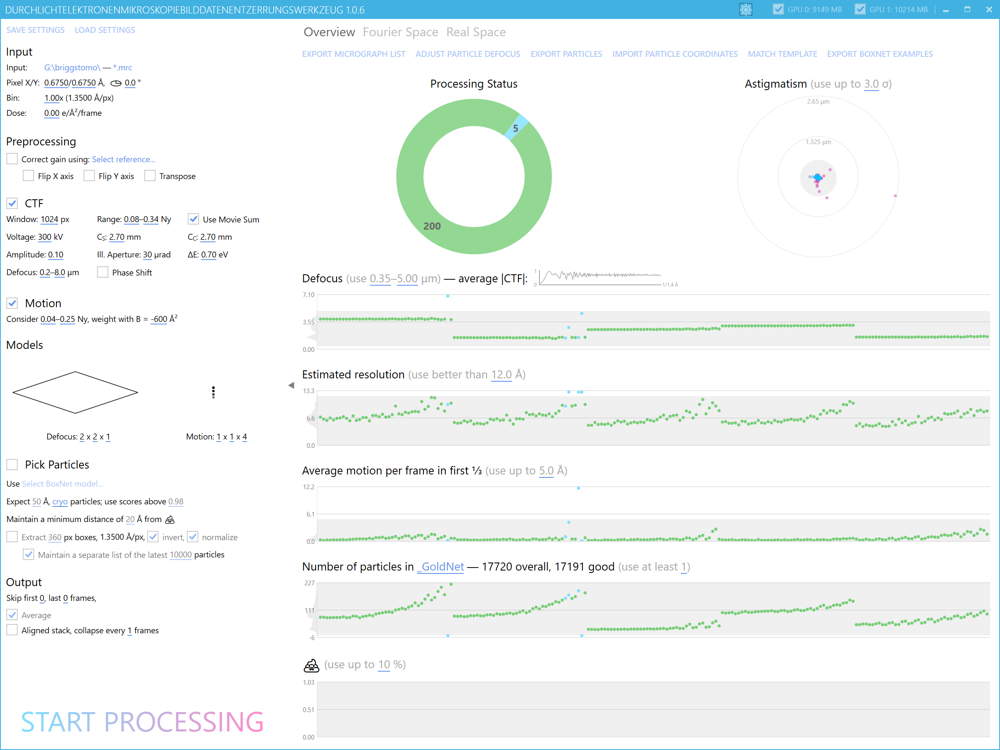
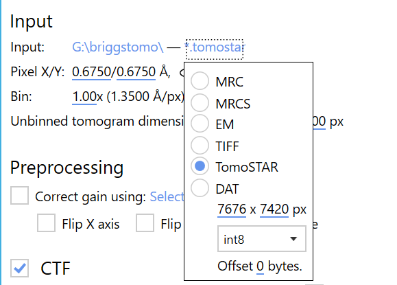
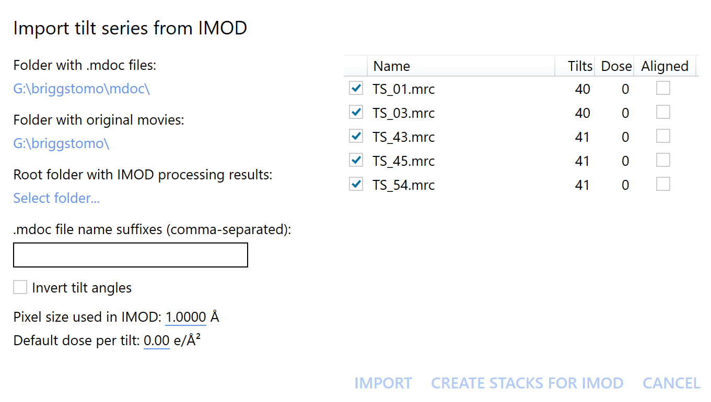
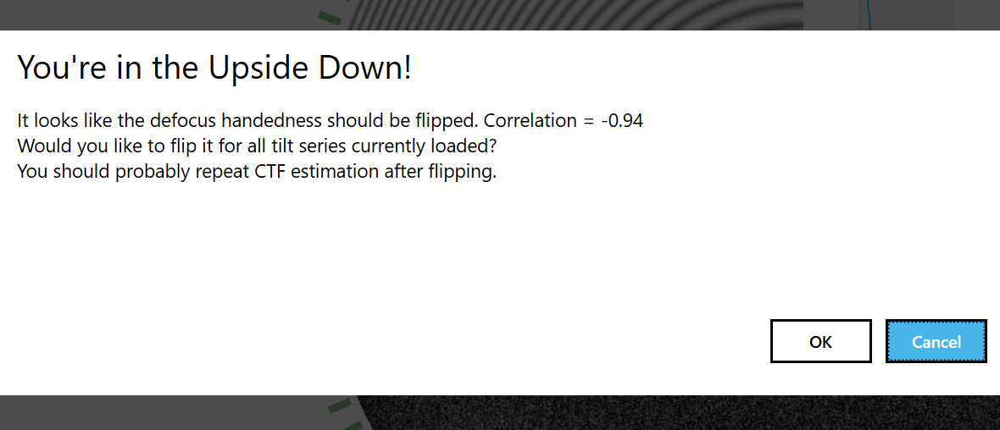
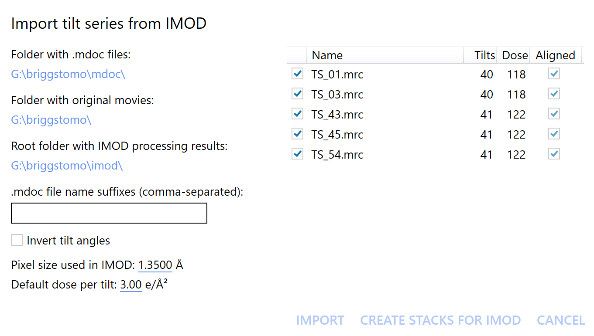
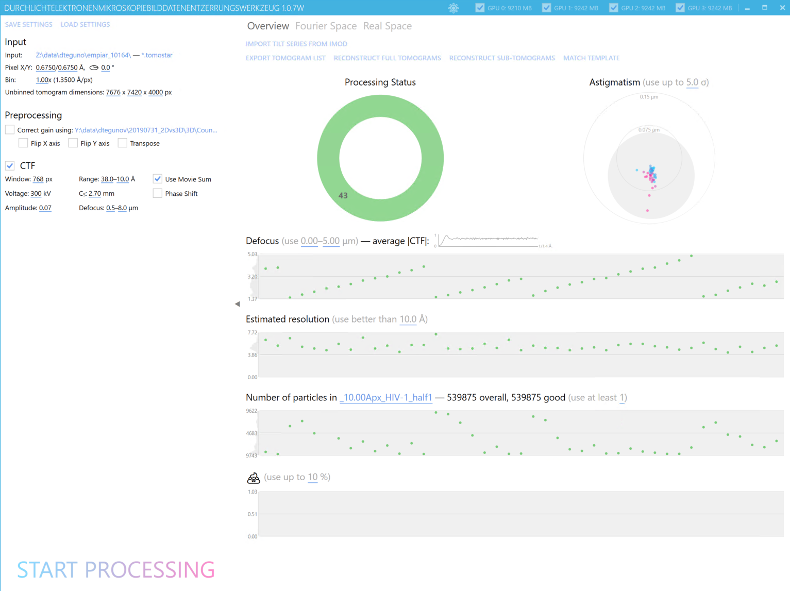

# Quick Start: Tilt Series

Tilt series pre-processing in Warp will allow you to reach higher resolution for your
sub-tomogram averages. However, unlike the pipeline for 2D data, the tilt series
pipeline still has a few gaps. You will have to switch
to [IMOD](http://bio3d.colorado.edu/imod/) to perform the initial tilt series
alignment (using patch tracking or gold fiducials). There is also no BoxNet-enabled
on-the-fly particle picking yet, and you will have to use a rather slow template
matching routine in offline mode. Metadata import is supported only for SerialEM
currently. We intend to address these shortcomings in the near future.

We will use data
from [EMPIAR-10164](https://www.ebi.ac.uk/pdbe/emdb/empiar/entry/10164/) in the
screenshots below – in particular, the 5 tomograms used in [Turonova *et
al.* 2017](http://europepmc.org/abstract/MED/28743638).

## Tilt movie pre-processing

The first step towards tilt series pre-processing in Warp is pre-processing the
individual tilt movies in 2D mode. If you’re not familiar with that procedure or Warp’s
basic interface features yet, please follow
the [2D quick start guide](./quick_start_warp_frame_series.md). Here are some
important differences to traditional 2D movie processing for this step:

- The motion model shouldn’t have spatial resolution, as there is usually not enough
  signal in a single tilt movie average for such fine alignment. Thus, the grid
  resolution will be 1x1xN. A good value for N is the number of frames in the shortest
  movie in case you’re using a collection scheme that increases the dose (and thus the
  movie duration) at higher tilts. If you’re fractionating the dose in very fine steps
  and collecting with a small pixel size, N can be lower than the frame count to avoid
  overfitting.
- If you already processed the data with a different pipeline and don’t want to repeat
  the tilt series alignments because the raw 2D movie alignments would change (e.g.,
  compared to MotionCor2), you can also reuse those pre-aligned averages. Just
  pre-process them instead of the movies. Obviously, the movement processing can be
  turned off. Warp will estimate the CTF and generate averages, which are an exact copy
  of the input images. This will feel very redundant, but the pipeline was written with
  movies in mind and doesn’t have a special case for single-frame images.
- The CTF can usually be estimated well with a 2x2x1 defocus grid. You can use these
  estimates to monitor data collection. However, the values will be re-estimated later
  during tilt series pre-processing using a more robust model. Because of the low amount
  of signal per tilt movie, it might help to check **Use Movie Sum**.
- Particle positions obtained with BoxNet won’t be considered later. However, the masks
  will be. In tilt series mode, those are assumed to cover gold beads and other
  high-contrast artifacts, and will be used to fill image areas with uncorrelated noise.
  You can quickly [retrain BoxNet](./boxnet/retraining.md) to mask out
  gold beads and not pick any particles. We would like to offer a pre-trained model for
  this purpose, but currently lack the training data. If you think such a model would be
  useful, please
  consider [contributing training data](./boxnet/retraining.md)!

## Export tilt series stacks for IMOD

IMOD’s **etomo** requires each tilt series to be assembled in a single MRC stack. You
can use Warp to combine the previously generated tilt movie averages into such stacks.

Switch Warp to tilt series mode by selecting **TomoSTAR** as the **Input format**. We
haven’t created any TomoSTAR files yet, but this mode will allow us to generate the data
necessary for tilt series alignment in etomo, which will eventually allow us to create
TomoSTAR files.

Once in tilt series mode, the Overview tab will contain the **Import tilt series from
IMOD** button. Click it to bring up the task dialog. Specify the folders containing the
**mdoc** files generated by SerialEM, and the **original tilt movies**. If there are
multiple mdoc files per tilt series (e.g. "plus" and "minus" after bi-directional
collection), you can specify several **suffixes**. Once these settings are set, all tilt
series should appear with the correct number of tilts in the list on the right.
Individual series can be deselected using the checkboxes next to their names. Click the
**Create stacks for IMOD** button to generate the stacks. This will create an *imod*
folder in the current project directory, and place each stack in a sub-folder named
after the respective tilt series. You can now execute etomo in each of these folders to
perform alignments. Please note that it isn't necessary to generate an aligned stack or
reconstruct tomograms in etomo, other than for diagnostic purposes. You can use **manual
deselection** in Warp's 2D pre-processing mode to **remove individual tilt images** from
the stack. Please remember to reflect these changes when setting up the project in
etomo.

You can also generate TomoSTAR files **without any alignments** at this point by
clicking the **Import** button. Please refer to the next section for information on how
to specify the **electron dose**.

### Create TomoSTAR files from IMOD's results

If you closed the **Import tilt series from IMOD** dialog from the previous section,
open it again. Specify the **mdoc** and **original tilt movie** folders, and the *
*suffixes** (if applicable) as before. For the **Root folder with IMOD processing
results**, select the *imod* subfolder created previously. If you didn't use Warp to set
up the folder structure as suggested in the previous section, make sure the alignment
results are located in *[project folder]/imod/[tilt series name]/*. Warp will try to
find the **xf** and **taSolution.log** files there. Please note that IMOD's pre-tilt
correction ("Tomogram positioning" tab in etomo) is currently not supported and
shouldn't be used if you want the results to match between IMOD and Warp. If everything
has been parsed correctly, the **Aligned** checkboxes should become checked.

**SUPER IMPORTANT HANDEDNESS NOTE:**  
Warp has a different convention for tilt angles and handedness compared to IMOD. By
default, the tilt angles will be multiplied by -1 upon import to match IMOD's 3D
reconstruction handedness. You can turn off this behavior by checking **Don't invert
tilt angles**. Now that the map handedness is correct, there is still the **defocus
handedness** to take care of. Although SerialEM is usually calibrated to produce the
correct map handedness in IMOD's 3D reconstructions, the defocus convention has about a
50:50 chance of being wrong across labs in our experience. Processing data with the
wrong handedness calibration will limit the resolution achievable for your sub-tomogram
averages. That would be a real pity! Luckily, Warp includes an easy way to check if the
calibration is wrong: Estimate the CTF for the raw tilt movies with a 2×2 spatial
resolution, then initialize and import the tilt series as described in this guide,
estimate the CTF for the entire tilt series, and click **Check tilt handedness** in the
**Fourier Space** tab. A dialog will appear to tell you the result and its certainty. -1
means certainly wrong, +1 means certainly correct. Values closer to 0 may arise because
the raw tilt movie CTF estimates were off due to weak signal. If the value is too close
to 0, you may want to try several tilt series and average the result to be sure. If it
turns out your defocus handedness is wrong, Warp will offer you to **flip the angles
used for defocus calculation**. This will change the *AreAnglesInverted* field in the
tilt series XML metadata. It is best to do this check and possible flipping before you
process the data any further.

Specify the same **Pixel size** you used in IMOD. Warp will use it to convert the shifts
to Ångström. For the electron dose, there are two options: SerialEM, when calibrated
accordingly, can store the dose values in the original mdoc files. If the calibration is
off or hasn't been done at all, you can specify a non-zero value in the **Default dose
per tilt** field. There is currently no option to conveniently specify varying dose
values. In case of dose-symmetric collection, it is usually OK to just use the per-tilt
dose of the very first tilt images for all tilts, since the higher tilts won't
contribute much information to high-resolution 3D averages anyway. If you absolutely
need to specify varying dose values, you will have to edit the *wrpDose* column in the
TomoSTAR files later.

That's it! Click **Import** to create the files and start processing them in Warp.

### Tilt series pre-processing

You will notice the **Input** section gained a new parameter: **Unbinned tomogram
dimensions**. The X and Y dimensions are usually similar to the input image size. Note
that for non-square sensors like the K3 the dimensions should reflect the sensor shape
if you don't want to lose data. However, the tomographic volume and raw image coordinate
systems are related to each other through the tilt axis angle. Often, the tilt axis is
close to the X axis in the raw images, while in the tomogram it is always assumed to be
aligned with the Y axis. Thus, if the raw image dimensions are 6000x4000 and the tilt
axis angle is around 90° or 270°, the tomogram dimensions should be 4000x6000. The Z
dimension depends on the sample thickness. You might have to do a few test
reconstructions (in Warp or IMOD) to figure out the right value. Ideally, the tomogram
should be thicker than the sample to allow for artifact-free template matching at its
borders. Choose these dimensions wisely: Once things like particle positions have been
established, changing the dimensions will invalidate those positions and will need to
either adjust the values by hand or start from scratch.

The **Bin** parameter has a somewhat different use in Warp compared to IMOD. First, it
is defined as an exponent, i.e. downsampling factor = 2^binning (the UI will tell you
the result), while in IMOD it is directly the downsampling factor. Second, there are
multiple places where binning can be set. The value defined in the **Input** section
will be used when loading the data, i.e. this is the maximum resolution any subsequent
operations on the data will be able to use. However, task dialogs
like [Tomogram reconstruction](./task_dialogs_tilt_series.md)
or [Sub-tomogram export](./task_dialogs_tilt_series.md) allow to set their own
target pixel size, which will bin the data additionally if it is larger (and it can't be
smaller) than the initial binned pixel size. Thus, you should only set the initial **Bin
** parameter if you know that you will never need to go to a lower pixel size – for
example, if you start with super-resolution data that need to be binned once to get to
the physical pixel size. Changing this value later will invalidate every already
pre-processed item.

The only pre-processing operation implemented for tilt series at the moment is CTF
estimation. Warp will estimate the defocus and astigmatism for the entire tilt series
while taking the tilt angles as constraints into account. The settings are the same as
in the 2D case, except for a lack of model resolution. Since all the information about
the Z position of objects in the tomogram will come from the tomogram itself, only a
global defocus offset is needed for each tilt. Additionally, because the sample rarely
lies flat in the focal plane, a global pre-tilt orientation is fitted for the entire
tilt series.

Once all items have been pre-processed, the quality filters work the same way they do in
2D mode. There is currently no real space view implemented for tilt series data – the
Fourier space tab is the only place where you will find useful per-item information.
