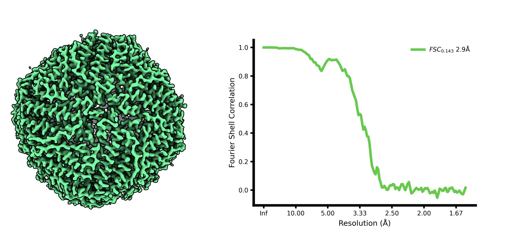
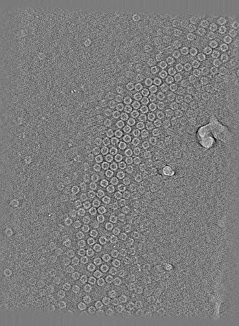
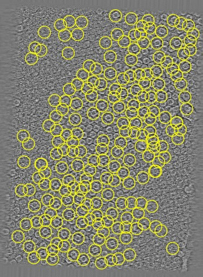
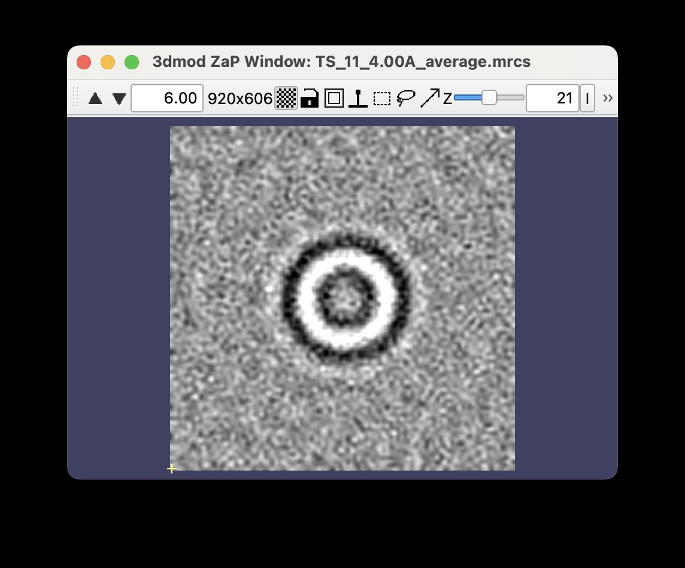
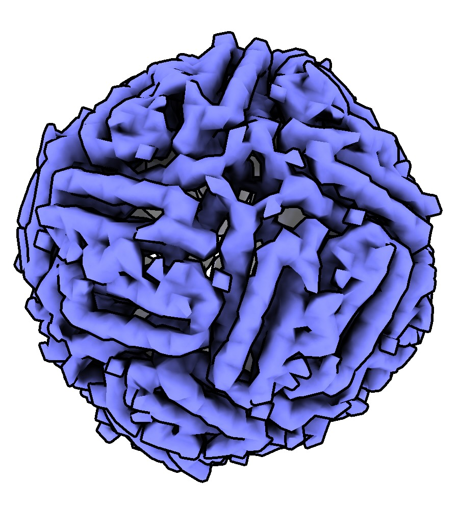

# Quick Start: Tilt Series

In this guide, you will learn how to process your tilt series data all the way from
frames and associated metadata to a nice high resolution map from the command line
using *WarpTools*! 🌟

We will be processing 5 tilt series of apoferritin from
[EMPIAR-10491](https://www.ebi.ac.uk/empiar/EMPIAR-10491/) as an example in this guide.

You should obtain a ~3Å map from these 5 tilt series following this guide.

<figure markdown="span">
  { width="80%" }
  <figcaption>Goal: A ~3Å map of apoferritin</figcaption>
</figure>


## Overview

- frame series preprocessing with *WarpTools*
- tilt series preprocessing with *WarpTools*
- initial 3D refinement in *RELION*
- multi-particle refinement with *MTools* and *MCore*

## Pre-Calculated Results

Pre-calculated results (38GB) are available to download at
[10.5281/zenodo.11398168](https://doi.org/10.5281/zenodo.11398168).

## Preparation

### Download the data

First, let's download the frame series data, mdoc metadata files and the
gain reference into an empty directory.

!!! info "only have tilt series stacks?"
    Check our guide on 
    [processing tilt series stacks](../../reference/warptools/processing_tilt_series_stacks.md) 
    to get started!

=== "shell script"

    ```bash
    # download the gain reference
    wget \
    --timestamping \
    --no-directories \
    --directory-prefix ./ \
    ftp://ftp.ebi.ac.uk/empiar/world_availability/10491/data/gain_ref.mrc;

    for i in 1 11 17 23 32;
    do
        echo "======================================================"
        echo "================= Downloading TS_${i} ================"
        # download the mdoc file
        wget \
        --timestamping \
        --no-directories \
        --directory-prefix ./mdoc \
        ftp://ftp.ebi.ac.uk/empiar/world_availability/10491/data/tiltseries/mdoc/TS_${i}.mrc.mdoc;
    
        # download the frames
        wget \
        --timestamping \
        --no-directories \
        --directory-prefix ./frames \
        ftp://ftp.ebi.ac.uk/empiar/world_availability/10491/data/tiltseries/data/*-${i}_*.tif;
    done
    ```

=== "`<root_dir>`"

    ```txt
    .
    ├── gain_ref.mrc
    ├── frames
    └── mdoc
    
    2 directories, 1 file    
    ```

=== "`frames`"

    ```txt
    ./frames
    ├── 2Dvs3D_53-1_00001_-0.0_Jul31_10.36.03.tif
    ├── 2Dvs3D_53-1_00002_2.0_Jul31_10.36.43.tif
    ├── 2Dvs3D_53-1_00003_4.0_Jul31_10.37.23.tif
    ├── 2Dvs3D_53-1_00004_-2.0_Jul31_10.38.06.tif
    ├── 2Dvs3D_53-1_00005_-4.0_Jul31_10.38.47.tif
    ├── 2Dvs3D_53-1_00006_6.0_Jul31_10.39.28.tif
    ├── 2Dvs3D_53-1_00007_8.0_Jul31_10.40.08.tif
    ├── 2Dvs3D_53-1_00008_-6.0_Jul31_10.40.51.tif
    ├── 2Dvs3D_53-1_00009_-8.0_Jul31_10.41.34.tif
    ├── 2Dvs3D_53-1_00010_10.0_Jul31_10.42.16.tif
    ├── 2Dvs3D_53-1_00011_12.0_Jul31_10.42.56.tif
    ├── 2Dvs3D_53-1_00012_-10.0_Jul31_10.43.39.tif
    ├── 2Dvs3D_53-1_00013_-12.0_Jul31_10.44.21.tif
    ├── 2Dvs3D_53-1_00014_14.0_Jul31_10.45.03.tif
    ├── 2Dvs3D_53-1_00015_16.0_Jul31_10.45.51.tif
    ├── 2Dvs3D_53-1_00016_-14.0_Jul31_10.46.47.tif
    ├── 2Dvs3D_53-1_00017_-16.0_Jul31_10.47.29.tif
    ├── 2Dvs3D_53-1_00018_18.0_Jul31_10.48.13.tif
    ├── 2Dvs3D_53-1_00019_20.0_Jul31_10.48.53.tif
    ├── 2Dvs3D_53-1_00020_-18.0_Jul31_10.49.38.tif
    ├── 2Dvs3D_53-1_00021_-20.0_Jul31_10.50.20.tif
    ├── 2Dvs3D_53-1_00022_22.0_Jul31_10.51.04.tif
    ├── 2Dvs3D_53-1_00023_24.0_Jul31_10.51.44.tif
    ├── 2Dvs3D_53-1_00024_-22.0_Jul31_10.52.29.tif
    ├── 2Dvs3D_53-1_00025_-24.0_Jul31_10.53.10.tif
    ├── 2Dvs3D_53-1_00026_26.0_Jul31_10.53.54.tif
    ├── 2Dvs3D_53-1_00027_28.0_Jul31_10.54.34.tif
    ├── 2Dvs3D_53-1_00028_-26.0_Jul31_10.55.20.tif
    ├── 2Dvs3D_53-1_00029_-28.0_Jul31_10.56.01.tif
    ├── 2Dvs3D_53-1_00030_30.0_Jul31_10.56.46.tif
    ├── 2Dvs3D_53-1_00031_32.0_Jul31_10.57.26.tif
    ├── 2Dvs3D_53-1_00032_-30.0_Jul31_10.58.12.tif
    ├── 2Dvs3D_53-1_00033_-32.0_Jul31_10.59.02.tif
    ├── 2Dvs3D_53-1_00034_34.0_Jul31_10.59.47.tif
    ├── 2Dvs3D_53-1_00035_36.0_Jul31_11.00.36.tif
    ├── 2Dvs3D_53-1_00036_-34.0_Jul31_11.01.23.tif
    ├── 2Dvs3D_53-1_00037_-36.0_Jul31_11.02.04.tif
    ├── 2Dvs3D_53-1_00038_38.0_Jul31_11.03.02.tif
    ├── 2Dvs3D_53-1_00039_40.0_Jul31_11.03.42.tif
    ├── 2Dvs3D_53-1_00040_-38.0_Jul31_11.04.30.tif
    ├── 2Dvs3D_53-1_00041_-40.0_Jul31_11.05.12.tif
    ├── 2Dvs3D_53-11_00001_-0.0_Jul31_16.50.54.tif
    ├── 2Dvs3D_53-11_00002_2.0_Jul31_16.51.34.tif
    ├── 2Dvs3D_53-11_00003_4.0_Jul31_16.52.14.tif
    ├── 2Dvs3D_53-11_00004_-2.0_Jul31_16.52.57.tif
    ├── 2Dvs3D_53-11_00005_-4.0_Jul31_16.53.38.tif
    ├── 2Dvs3D_53-11_00006_6.0_Jul31_16.54.20.tif
    ├── 2Dvs3D_53-11_00007_8.0_Jul31_16.54.59.tif
    ├── 2Dvs3D_53-11_00008_-6.0_Jul31_16.55.43.tif
    ├── 2Dvs3D_53-11_00009_-8.0_Jul31_16.56.25.tif
    ├── 2Dvs3D_53-11_00010_10.0_Jul31_16.57.07.tif
    ├── 2Dvs3D_53-11_00011_12.0_Jul31_16.57.47.tif
    ├── 2Dvs3D_53-11_00012_-10.0_Jul31_16.58.31.tif
    ├── 2Dvs3D_53-11_00013_-12.0_Jul31_16.59.13.tif
    ├── 2Dvs3D_53-11_00014_14.0_Jul31_16.59.55.tif
    ├── 2Dvs3D_53-11_00015_16.0_Jul31_17.00.35.tif
    ├── 2Dvs3D_53-11_00016_-14.0_Jul31_17.01.19.tif
    ├── 2Dvs3D_53-11_00017_-16.0_Jul31_17.02.01.tif
    ├── 2Dvs3D_53-11_00018_18.0_Jul31_17.02.52.tif
    ├── 2Dvs3D_53-11_00019_20.0_Jul31_17.03.33.tif
    ├── 2Dvs3D_53-11_00020_-18.0_Jul31_17.04.18.tif
    ├── 2Dvs3D_53-11_00021_-20.0_Jul31_17.05.08.tif
    ├── 2Dvs3D_53-11_00022_22.0_Jul31_17.05.52.tif
    ├── 2Dvs3D_53-11_00023_24.0_Jul31_17.06.32.tif
    ├── 2Dvs3D_53-11_00024_-22.0_Jul31_17.07.18.tif
    ├── 2Dvs3D_53-11_00025_-24.0_Jul31_17.07.59.tif
    ├── 2Dvs3D_53-11_00026_26.0_Jul31_17.08.44.tif
    ├── 2Dvs3D_53-11_00027_28.0_Jul31_17.09.24.tif
    ├── 2Dvs3D_53-11_00028_-26.0_Jul31_17.10.09.tif
    ├── 2Dvs3D_53-11_00029_-28.0_Jul31_17.10.51.tif
    ├── 2Dvs3D_53-11_00030_30.0_Jul31_17.11.37.tif
    ├── 2Dvs3D_53-11_00031_32.0_Jul31_17.12.17.tif
    ├── 2Dvs3D_53-11_00032_-30.0_Jul31_17.13.23.tif
    ├── 2Dvs3D_53-11_00033_-32.0_Jul31_17.14.05.tif
    ├── 2Dvs3D_53-11_00034_34.0_Jul31_17.14.51.tif
    ├── 2Dvs3D_53-11_00035_36.0_Jul31_17.15.31.tif
    ├── 2Dvs3D_53-11_00036_-34.0_Jul31_17.16.18.tif
    ├── 2Dvs3D_53-11_00037_-36.0_Jul31_17.17.00.tif
    ├── 2Dvs3D_53-11_00038_38.0_Jul31_17.17.46.tif
    ├── 2Dvs3D_53-11_00039_40.0_Jul31_17.18.26.tif
    ├── 2Dvs3D_53-11_00040_-38.0_Jul31_17.19.13.tif
    ├── 2Dvs3D_53-11_00041_-40.0_Jul31_17.19.55.tif
    ├── 2Dvs3D_53-17_00001_-0.0_Jul31_21.21.04.tif
    ├── 2Dvs3D_53-17_00002_2.0_Jul31_21.21.44.tif
    ├── 2Dvs3D_53-17_00003_4.0_Jul31_21.22.24.tif
    ├── 2Dvs3D_53-17_00004_-2.0_Jul31_21.23.07.tif
    ├── 2Dvs3D_53-17_00005_-4.0_Jul31_21.23.48.tif
    ├── 2Dvs3D_53-17_00006_6.0_Jul31_21.24.29.tif
    ├── 2Dvs3D_53-17_00007_8.0_Jul31_21.25.09.tif
    ├── 2Dvs3D_53-17_00008_-6.0_Jul31_21.25.53.tif
    ├── 2Dvs3D_53-17_00009_-8.0_Jul31_21.26.34.tif
    ├── 2Dvs3D_53-17_00010_10.0_Jul31_21.27.17.tif
    ├── 2Dvs3D_53-17_00011_12.0_Jul31_21.27.56.tif
    ├── 2Dvs3D_53-17_00012_-10.0_Jul31_21.28.41.tif
    ├── 2Dvs3D_53-17_00013_-12.0_Jul31_21.29.23.tif
    ├── 2Dvs3D_53-17_00014_14.0_Jul31_21.30.07.tif
    ├── 2Dvs3D_53-17_00015_16.0_Jul31_21.30.47.tif
    ├── 2Dvs3D_53-17_00016_-14.0_Jul31_21.31.43.tif
    ├── 2Dvs3D_53-17_00017_-16.0_Jul31_21.32.25.tif
    ├── 2Dvs3D_53-17_00018_18.0_Jul31_21.33.08.tif
    ├── 2Dvs3D_53-17_00019_20.0_Jul31_21.33.47.tif
    ├── 2Dvs3D_53-17_00020_-18.0_Jul31_21.34.32.tif
    ├── 2Dvs3D_53-17_00021_-20.0_Jul31_21.35.14.tif
    ├── 2Dvs3D_53-17_00022_22.0_Jul31_21.35.58.tif
    ├── 2Dvs3D_53-17_00023_24.0_Jul31_21.36.38.tif
    ├── 2Dvs3D_53-17_00024_-22.0_Jul31_21.37.24.tif
    ├── 2Dvs3D_53-17_00025_-24.0_Jul31_21.38.07.tif
    ├── 2Dvs3D_53-17_00026_26.0_Jul31_21.38.51.tif
    ├── 2Dvs3D_53-17_00027_28.0_Jul31_21.39.31.tif
    ├── 2Dvs3D_53-17_00028_-26.0_Jul31_21.40.17.tif
    ├── 2Dvs3D_53-17_00029_-28.0_Jul31_21.41.07.tif
    ├── 2Dvs3D_53-17_00030_30.0_Jul31_21.41.51.tif
    ├── 2Dvs3D_53-17_00031_32.0_Jul31_21.42.31.tif
    ├── 2Dvs3D_53-17_00032_-30.0_Jul31_21.43.18.tif
    ├── 2Dvs3D_53-17_00033_-32.0_Jul31_21.44.01.tif
    ├── 2Dvs3D_53-17_00034_34.0_Jul31_21.44.45.tif
    ├── 2Dvs3D_53-17_00035_36.0_Jul31_21.45.26.tif
    ├── 2Dvs3D_53-17_00036_-34.0_Jul31_21.46.12.tif
    ├── 2Dvs3D_53-17_00037_-36.0_Jul31_21.46.55.tif
    ├── 2Dvs3D_53-17_00038_38.0_Jul31_21.47.40.tif
    ├── 2Dvs3D_53-17_00039_40.0_Jul31_21.48.20.tif
    ├── 2Dvs3D_53-17_00040_-38.0_Jul31_21.49.08.tif
    ├── 2Dvs3D_53-17_00041_-40.0_Jul31_21.49.50.tif
    ├── 2Dvs3D_53-23_00001_-0.0_Aug01_10.29.18.tif
    ├── 2Dvs3D_53-23_00002_2.0_Aug01_10.29.58.tif
    ├── 2Dvs3D_53-23_00003_4.0_Aug01_10.30.39.tif
    ├── 2Dvs3D_53-23_00004_-2.0_Aug01_10.31.21.tif
    ├── 2Dvs3D_53-23_00005_-4.0_Aug01_10.32.02.tif
    ├── 2Dvs3D_53-23_00006_6.0_Aug01_10.32.43.tif
    ├── 2Dvs3D_53-23_00007_8.0_Aug01_10.33.23.tif
    ├── 2Dvs3D_53-23_00008_-6.0_Aug01_10.34.06.tif
    ├── 2Dvs3D_53-23_00009_-8.0_Aug01_10.34.48.tif
    ├── 2Dvs3D_53-23_00010_10.0_Aug01_10.35.30.tif
    ├── 2Dvs3D_53-23_00011_12.0_Aug01_10.36.10.tif
    ├── 2Dvs3D_53-23_00012_-10.0_Aug01_10.36.53.tif
    ├── 2Dvs3D_53-23_00013_-12.0_Aug01_10.37.34.tif
    ├── 2Dvs3D_53-23_00014_14.0_Aug01_10.38.17.tif
    ├── 2Dvs3D_53-23_00015_16.0_Aug01_10.38.58.tif
    ├── 2Dvs3D_53-23_00016_-14.0_Aug01_10.39.42.tif
    ├── 2Dvs3D_53-23_00017_-16.0_Aug01_10.40.24.tif
    ├── 2Dvs3D_53-23_00018_18.0_Aug01_10.41.07.tif
    ├── 2Dvs3D_53-23_00019_20.0_Aug01_10.41.47.tif
    ├── 2Dvs3D_53-23_00020_-18.0_Aug01_10.42.32.tif
    ├── 2Dvs3D_53-23_00021_-20.0_Aug01_10.43.14.tif
    ├── 2Dvs3D_53-23_00022_22.0_Aug01_10.43.57.tif
    ├── 2Dvs3D_53-23_00023_24.0_Aug01_10.44.38.tif
    ├── 2Dvs3D_53-23_00024_-22.0_Aug01_10.45.24.tif
    ├── 2Dvs3D_53-23_00025_-24.0_Aug01_10.46.06.tif
    ├── 2Dvs3D_53-23_00026_26.0_Aug01_10.46.50.tif
    ├── 2Dvs3D_53-23_00027_28.0_Aug01_10.47.31.tif
    ├── 2Dvs3D_53-23_00028_-26.0_Aug01_10.48.16.tif
    ├── 2Dvs3D_53-23_00029_-28.0_Aug01_10.48.58.tif
    ├── 2Dvs3D_53-23_00030_30.0_Aug01_10.49.50.tif
    ├── 2Dvs3D_53-23_00031_32.0_Aug01_10.50.30.tif
    ├── 2Dvs3D_53-23_00032_-30.0_Aug01_10.51.17.tif
    ├── 2Dvs3D_53-23_00033_-32.0_Aug01_10.51.59.tif
    ├── 2Dvs3D_53-23_00034_34.0_Aug01_10.52.51.tif
    ├── 2Dvs3D_53-23_00035_36.0_Aug01_10.53.39.tif
    ├── 2Dvs3D_53-23_00036_-34.0_Aug01_10.54.28.tif
    ├── 2Dvs3D_53-23_00037_-36.0_Aug01_10.55.10.tif
    ├── 2Dvs3D_53-23_00038_38.0_Aug01_10.56.03.tif
    ├── 2Dvs3D_53-23_00039_40.0_Aug01_10.56.43.tif
    ├── 2Dvs3D_53-23_00040_-38.0_Aug01_10.57.30.tif
    ├── 2Dvs3D_53-23_00041_-40.0_Aug01_10.58.12.tif
    ├── 2Dvs3D_53-32_00001_-0.0_Aug01_19.22.49.tif
    ├── 2Dvs3D_53-32_00002_2.0_Aug01_19.23.29.tif
    ├── 2Dvs3D_53-32_00003_4.0_Aug01_19.24.09.tif
    ├── 2Dvs3D_53-32_00004_-2.0_Aug01_19.24.51.tif
    ├── 2Dvs3D_53-32_00005_-4.0_Aug01_19.25.33.tif
    ├── 2Dvs3D_53-32_00006_6.0_Aug01_19.26.14.tif
    ├── 2Dvs3D_53-32_00007_8.0_Aug01_19.26.54.tif
    ├── 2Dvs3D_53-32_00008_-6.0_Aug01_19.27.38.tif
    ├── 2Dvs3D_53-32_00009_-8.0_Aug01_19.28.19.tif
    ├── 2Dvs3D_53-32_00010_10.0_Aug01_19.29.01.tif
    ├── 2Dvs3D_53-32_00011_12.0_Aug01_19.29.53.tif
    ├── 2Dvs3D_53-32_00012_-10.0_Aug01_19.30.36.tif
    ├── 2Dvs3D_53-32_00013_-12.0_Aug01_19.31.18.tif
    ├── 2Dvs3D_53-32_00014_14.0_Aug01_19.32.01.tif
    ├── 2Dvs3D_53-32_00015_16.0_Aug01_19.32.40.tif
    ├── 2Dvs3D_53-32_00016_-14.0_Aug01_19.33.25.tif
    ├── 2Dvs3D_53-32_00017_-16.0_Aug01_19.34.07.tif
    ├── 2Dvs3D_53-32_00018_18.0_Aug01_19.34.49.tif
    ├── 2Dvs3D_53-32_00019_20.0_Aug01_19.35.29.tif
    ├── 2Dvs3D_53-32_00020_-18.0_Aug01_19.36.14.tif
    ├── 2Dvs3D_53-32_00021_-20.0_Aug01_19.36.56.tif
    ├── 2Dvs3D_53-32_00022_22.0_Aug01_19.38.03.tif
    ├── 2Dvs3D_53-32_00023_24.0_Aug01_19.38.43.tif
    ├── 2Dvs3D_53-32_00024_26.0_Aug01_19.39.23.tif
    ├── 2Dvs3D_53-32_00025_28.0_Aug01_19.40.03.tif
    ├── 2Dvs3D_53-32_00026_30.0_Aug01_19.40.43.tif
    ├── 2Dvs3D_53-32_00027_32.0_Aug01_19.41.23.tif
    ├── 2Dvs3D_53-32_00028_34.0_Aug01_19.42.02.tif
    ├── 2Dvs3D_53-32_00029_36.0_Aug01_19.42.42.tif
    ├── 2Dvs3D_53-32_00030_38.0_Aug01_19.43.22.tif
    ├── 2Dvs3D_53-32_00031_40.0_Aug01_19.44.02.tif
    ├── 2Dvs3D_53-32_00032_-22.0_Aug01_19.45.21.tif
    ├── 2Dvs3D_53-32_00033_-24.0_Aug01_19.46.03.tif
    ├── 2Dvs3D_53-32_00034_-26.0_Aug01_19.46.45.tif
    ├── 2Dvs3D_53-32_00035_-28.0_Aug01_19.47.28.tif
    ├── 2Dvs3D_53-32_00036_-30.0_Aug01_19.48.11.tif
    ├── 2Dvs3D_53-32_00037_-32.0_Aug01_19.48.54.tif
    ├── 2Dvs3D_53-32_00038_-34.0_Aug01_19.49.43.tif
    ├── 2Dvs3D_53-32_00039_-36.0_Aug01_19.50.33.tif
    ├── 2Dvs3D_53-32_00040_-38.0_Aug01_19.51.16.tif
    ├── 2Dvs3D_53-32_00041_-40.0_Aug01_19.51.58.tif
    ├── 2Dvs3D_59-11_00001_-0.0_Aug02_01.08.03.tif
    ├── 2Dvs3D_59-11_00002_2.0_Aug02_01.08.43.tif
    ├── 2Dvs3D_59-11_00003_4.0_Aug02_01.09.23.tif
    ├── 2Dvs3D_59-11_00004_-2.0_Aug02_01.10.06.tif
    ├── 2Dvs3D_59-11_00005_-4.0_Aug02_01.10.47.tif
    ├── 2Dvs3D_59-11_00006_6.0_Aug02_01.11.29.tif
    ├── 2Dvs3D_59-11_00007_8.0_Aug02_01.12.09.tif
    ├── 2Dvs3D_59-11_00008_-6.0_Aug02_01.12.52.tif
    ├── 2Dvs3D_59-11_00009_-8.0_Aug02_01.13.34.tif
    ├── 2Dvs3D_59-11_00010_10.0_Aug02_01.14.15.tif
    ├── 2Dvs3D_59-11_00011_12.0_Aug02_01.14.55.tif
    ├── 2Dvs3D_59-11_00012_-10.0_Aug02_01.15.39.tif
    ├── 2Dvs3D_59-11_00013_-12.0_Aug02_01.16.21.tif
    ├── 2Dvs3D_59-11_00014_14.0_Aug02_01.17.03.tif
    ├── 2Dvs3D_59-11_00015_16.0_Aug02_01.17.43.tif
    ├── 2Dvs3D_59-11_00016_-14.0_Aug02_01.18.28.tif
    ├── 2Dvs3D_59-11_00017_-16.0_Aug02_01.19.10.tif
    ├── 2Dvs3D_59-11_00018_18.0_Aug02_01.19.53.tif
    ├── 2Dvs3D_59-11_00019_20.0_Aug02_01.20.32.tif
    ├── 2Dvs3D_59-11_00020_-18.0_Aug02_01.21.17.tif
    ├── 2Dvs3D_59-11_00021_-20.0_Aug02_01.22.00.tif
    ├── 2Dvs3D_59-11_00022_22.0_Aug02_01.23.04.tif
    ├── 2Dvs3D_59-11_00023_24.0_Aug02_01.23.44.tif
    ├── 2Dvs3D_59-11_00024_26.0_Aug02_01.24.24.tif
    ├── 2Dvs3D_59-11_00025_28.0_Aug02_01.25.04.tif
    ├── 2Dvs3D_59-11_00026_30.0_Aug02_01.25.44.tif
    ├── 2Dvs3D_59-11_00027_32.0_Aug02_01.26.24.tif
    ├── 2Dvs3D_59-11_00028_34.0_Aug02_01.27.04.tif
    ├── 2Dvs3D_59-11_00029_36.0_Aug02_01.27.45.tif
    ├── 2Dvs3D_59-11_00030_38.0_Aug02_01.28.25.tif
    ├── 2Dvs3D_59-11_00031_40.0_Aug02_01.29.05.tif
    ├── 2Dvs3D_59-11_00032_-22.0_Aug02_01.30.24.tif
    ├── 2Dvs3D_59-11_00033_-24.0_Aug02_01.31.06.tif
    ├── 2Dvs3D_59-11_00034_-26.0_Aug02_01.31.48.tif
    ├── 2Dvs3D_59-11_00035_-28.0_Aug02_01.32.30.tif
    ├── 2Dvs3D_59-11_00036_-30.0_Aug02_01.33.12.tif
    ├── 2Dvs3D_59-11_00037_-32.0_Aug02_01.33.55.tif
    ├── 2Dvs3D_59-11_00038_-34.0_Aug02_01.34.44.tif
    ├── 2Dvs3D_59-11_00039_-36.0_Aug02_01.35.26.tif
    ├── 2Dvs3D_59-11_00040_-38.0_Aug02_01.36.16.tif
    ├── 2Dvs3D_59-11_00041_-40.0_Aug02_01.36.58.tif
    ├── 2Dvs3D_59-32_00001_-0.0_Aug02_10.40.58.tif
    ├── 2Dvs3D_59-32_00002_2.0_Aug02_10.41.38.tif
    ├── 2Dvs3D_59-32_00003_4.0_Aug02_10.42.19.tif
    ├── 2Dvs3D_59-32_00004_-2.0_Aug02_10.43.04.tif
    ├── 2Dvs3D_59-32_00005_-4.0_Aug02_10.43.49.tif
    ├── 2Dvs3D_59-32_00006_6.0_Aug02_10.44.31.tif
    ├── 2Dvs3D_59-32_00007_8.0_Aug02_10.45.10.tif
    ├── 2Dvs3D_59-32_00008_-6.0_Aug02_10.45.55.tif
    ├── 2Dvs3D_59-32_00009_-8.0_Aug02_10.46.37.tif
    ├── 2Dvs3D_59-32_00010_10.0_Aug02_10.47.19.tif
    ├── 2Dvs3D_59-32_00011_12.0_Aug02_10.47.58.tif
    ├── 2Dvs3D_59-32_00012_-10.0_Aug02_10.48.50.tif
    ├── 2Dvs3D_59-32_00013_-12.0_Aug02_10.49.31.tif
    ├── 2Dvs3D_59-32_00014_14.0_Aug02_10.50.15.tif
    ├── 2Dvs3D_59-32_00015_16.0_Aug02_10.50.54.tif
    ├── 2Dvs3D_59-32_00016_-14.0_Aug02_10.51.47.tif
    ├── 2Dvs3D_59-32_00017_-16.0_Aug02_10.52.29.tif
    ├── 2Dvs3D_59-32_00018_18.0_Aug02_10.53.11.tif
    ├── 2Dvs3D_59-32_00019_20.0_Aug02_10.53.58.tif
    ├── 2Dvs3D_59-32_00020_-18.0_Aug02_10.54.51.tif
    ├── 2Dvs3D_59-32_00021_-20.0_Aug02_10.55.33.tif
    ├── 2Dvs3D_59-32_00022_22.0_Aug02_10.56.37.tif
    ├── 2Dvs3D_59-32_00023_24.0_Aug02_10.57.26.tif
    ├── 2Dvs3D_59-32_00024_26.0_Aug02_10.58.13.tif
    ├── 2Dvs3D_59-32_00025_28.0_Aug02_10.59.01.tif
    ├── 2Dvs3D_59-32_00026_30.0_Aug02_10.59.49.tif
    ├── 2Dvs3D_59-32_00027_32.0_Aug02_11.00.37.tif
    ├── 2Dvs3D_59-32_00028_34.0_Aug02_11.01.24.tif
    ├── 2Dvs3D_59-32_00029_36.0_Aug02_11.02.11.tif
    ├── 2Dvs3D_59-32_00030_38.0_Aug02_11.03.00.tif
    ├── 2Dvs3D_59-32_00031_40.0_Aug02_11.03.47.tif
    ├── 2Dvs3D_59-32_00032_-22.0_Aug02_11.05.03.tif
    ├── 2Dvs3D_59-32_00033_-24.0_Aug02_11.05.46.tif
    ├── 2Dvs3D_59-32_00034_-26.0_Aug02_11.06.28.tif
    ├── 2Dvs3D_59-32_00035_-28.0_Aug02_11.07.10.tif
    ├── 2Dvs3D_59-32_00036_-30.0_Aug02_11.07.52.tif
    ├── 2Dvs3D_59-32_00037_-32.0_Aug02_11.08.34.tif
    ├── 2Dvs3D_59-32_00038_-34.0_Aug02_11.09.16.tif
    ├── 2Dvs3D_59-32_00039_-36.0_Aug02_11.09.58.tif
    ├── 2Dvs3D_59-32_00040_-38.0_Aug02_11.10.41.tif
    └── 2Dvs3D_59-32_00041_-40.0_Aug02_11.11.23.tif
    ```

=== "`mdoc`"

    ```txt
    ./mdoc
    ├── TS_11.mrc.mdoc
    ├── TS_17.mrc.mdoc
    ├── TS_1.mrc.mdoc
    ├── TS_23.mrc.mdoc
    └── TS_32.mrc.mdoc
    ```

### Create Warp Settings Files

Settings files are config files which tell *WarpTools*

1. where to look for data to process
2. where to store results
3. relevant metadata

We will create two settings files,
`warp_frameseries.settings` and `warp_tiltseries.settings`.
These will be used for frame series and tilt series processing respectively.

=== "Frame Series"

    ```txt title="Create Frame Series Settings File"
    WarpTools create_settings \
    --folder_data frames \
    --folder_processing warp_frameseries \
    --output warp_frameseries.settings \
    --extension "*.tif" \
    --angpix 0.7894 \
    --gain_path gain_ref.mrc \
    --gain_flip_y \
    --exposure 2.64
    ```

=== "Tilt Series"

    ```bash title="Create Tilt Series Settings File"
    WarpTools create_settings \
    --output warp_tiltseries.settings \
    --folder_processing warp_tiltseries \
    --folder_data tomostar \
    --extension "*.tomostar" \
    --angpix 0.7894 \
    --gain_path gain_ref.mrc \
    --gain_flip_y \
    --exposure 2.64 \
    --tomo_dimensions 4400x6000x1000 # (1)!
    ```

    1.  :man_raising_hand: These are the dimensions of your tomograms in unbinned pixels.
        Tomograms are reconstructed with the tilt axis aligned along Y, remember to 
        account for rotation of the tilt axis when setting these dimensions!

!!! tip "Processing EER files?"
    add `--eer_ngroups` or `--eer_groupexposure` to your settings creation command

## Preprocessing: From Frames to Tomograms

### Frame Series: Motion and CTF Estimation

The first step in processing tilt movies involves estimating 2D sample motion and
contrast transfer function.

```sh title="Frame Series Motion and CTF Estimation"
WarpTools fs_motion_and_ctf \
--settings warp_frameseries.settings \
--m_grid 1x1x3 \
--c_grid 2x2x1 \
--c_range_max 7 \
--c_defocus_max 8 \
--c_use_sum \
--out_averages \
--out_average_halves # (1)!
```

1. :man_raising_hand: averages of half sets of frames are required for Noise2Noise
   based denoising of images and tomograms

Motion corrected averages will be written out to the `warp_frameseries/average`
directory.
Motion and CTF related metadata will be written into XML files, one per frame series, in
the `warp_frameseries` directory.

!!! tip

    Algorithms in WarpTools were written for GPUs with ~16GB memory. 
    
    If you're lucky enough to access to bigger cards, try running multiple worker processes 
    per GPU. We typically use `--perdevice 4` on A100 cards with 80GB memory.

!!! question "Need more info?"
    All command line options and associated help text can be seen on our [API reference pages](../../reference/warptools/api/general.md)

#### Parameters explained

#### Grids

The `--m_grid 1x1x3` and `--c_grid 2x2x1` parameters define the resolution (`XxYxT`) of
motion and CTF models that will be estimated.

When processing tilt series data we typically recommend `1x1xNFrames` for motion grids
due to the low amount of signal available per tilt and `2x2x1` for CTF grids to enable
checking that defocus varies as expected across the tilt axis.

#### CTF Parameters

- `--c_range_max` is the maximum spatial resolution of information used for fitting in Å
- `--c_defocus_max` is the maximum allowed defocus value

`--c_use_sum` controls whether CTF estimation use the power spectrum from the
motion corrected average or the sum of per-frame power spectra for estimation.
Estimating from the motion corrected average can be useful in the absence of an
energy filter, or generally when per frame signal is low.

#### Visualizing Results

Just because you're at the command line doesn't mean you should have to dig through
text files to see how your processing went.
Use our handy `filter_quality` WarpTool to see various statistics about your data
processing
printed to the terminal.

=== "Command"

```txt title="Plot Histograms of 2D Processing Metrics"
WarpTools filter_quality --settings warp_frameseries.settings --histograms
```

=== "Motion"

    ```txt
    Motion in first 1/3 (Å):
    0.1 - 0.4: █████████████████████████████████████████████████████████████████████ 72
    0.4 - 0.8: ████████████████████████████████████████████████████████████████████████████████ 84
    0.8 - 1.2: ████████████████████████████████████████████████████ 55
    1.2 - 1.5: ██████████████████████████ 27
    1.5 - 1.9: █████████████████ 18
    1.9 - 2.3: █████ 5
    2.3 - 2.6: █████ 5
    2.6 - 3.0: ████ 4
    3.0 - 3.4: ██ 2
    3.4 - 3.7: ██ 2
    3.7 - 4.1: ████ 4
    4.1 - 4.4: ████ 4
    4.4 - 4.8: █ 1
    4.8 - 5.2: ██ 2
    5.2 - 5.5:  0
    5.5 - 5.9: █ 1
    5.9 - 6.3: █ 1
    ```

=== "Defocus"

    ```txt
    Defocus (µm):
    1.3 - 1.6: █ 1
    1.6 - 1.9:  0
    1.9 - 2.2: ██ 4
    2.2 - 2.6: ████████████████████████████████████████████████████████████████████████████████ 149
    2.6 - 2.9: ███████████████████████████████████████████████████████████████████████ 132
    2.9 - 3.2:  0
    3.2 - 3.6:  0
    3.6 - 3.9:  0
    3.9 - 4.2:  0
    4.2 - 4.6:  0
    4.6 - 4.9:  0
    4.9 - 5.2:  0
    5.2 - 5.5:  0
    5.5 - 5.9:  0
    5.9 - 6.2:  0
    6.2 - 6.5:  0
    6.5 - 6.9: █ 1
    ```

=== "Astigmatism"

    ```txt
    Astigmatism (µm): max = 26
     0.18 - 0.20 : |            ·                     |
     0.15 - 0.18 : |                ·                 |
     0.13 - 0.15 : |                                  |
     0.11 - 0.13 : |                        ·         |
     0.08 - 0.11 : |                · ·     ·         |
     0.06 - 0.08 : |              ·   · · ·           |
     0.04 - 0.06 : |·       ·   · ··░░░░··            |
     0.01 - 0.04 : |        ··· ░░░░▒▒▓▓···           |
    -0.01 - 0.01 : |·         · ░░▒▒██▓▓▒▒·         · |
    -0.04 - -0.01: |          · ░░▒▒▓▓▒▒░░···         |
    -0.06 - -0.04: |        · · · ░░▒▒▓▓··  ···       |
    -0.08 - -0.06: |          · · ······· ··          |
    -0.11 - -0.08: |                ···     ·         |
    -0.13 - -0.11: |        ·     ·                   |
    -0.15 - -0.13: |                                  |
    -0.18 - -0.15: |                                  |
    -0.20 - -0.18: |                                  |
    ```

=== "CTF Resolution"

    ```txt
    CTF resolution (Å):
    3.7 - 4.2 : ██████████ 8
    4.2 - 4.6 : ███████████████████████████████████ 29
    4.6 - 5.1 : ██████████████████████████████████████████████ 38
    5.1 - 5.5 : ██████████████████████████████████████████████████████████████████████████████ 64
    5.5 - 6.0 : ██████████████████████████████████████████████████████████████ 51
    6.0 - 6.5 : ████████████████████████████████████████████████████████████████████████████████ 66
    6.5 - 6.9 : ████████████████████████████ 23
    6.9 - 7.4 : █████ 4
    7.4 - 7.8 : ██ 2
    7.8 - 8.3 : █ 1
    8.3 - 8.7 :  0
    8.7 - 9.2 :  0
    9.2 - 9.7 :  0
    9.7 - 10.1:  0
    10.1 - 10.6:  0
    10.6 - 11.0:  0
    11.0 - 11.5: █ 1
    ```

=== "Phase Shift"

    ```txt
    Phase shift (π):
    0.0 - 0.0: ████████████████████████████████████████████████████████████████████████████████ 287
    ```

=== "💩"

    ```txt
    Masked area (%):
    0.0 - 0.0: ████████████████████████████████████████████████████████████████████████████████ 287
    ```

### Tilt Series: Import

Next we have to tell *WarpTools* which movies belong to which tilt series
so we can process them.

We tell *WarpTools* about the per-tilt exposure so that we can keep track of the
cumulative dose received for each tilt. We also have an option to remove images which
are darker than expected by supplying `--min_intensity` at this stage. (1)
{ .annotate }

1. :man_raising_hand: images are removed if their intensity is less
   than `min_intensity` * `cos(tilt_angle)` * `0-tilt intensity`

This command produces files with the *tomostar* extension, these are STAR files with
necessary information in them for further processing in *WarpTools*.
We put these in a folder called `tomostar`

```sh title="Import Tilt Series Metadata"
WarpTools ts_import \
--mdocs mdoc \
--frameseries warp_frameseries \
--tilt_exposure 2.64 \
--min_intensity 0.3 \
--dont_invert \ # (1)!
--output tomostar
```

1. :man_raising_hand: this option inverts geometric handedness by flipping the
   tomogram reconstruction through the XY plane, we do this here because we know for
   this dataset it leads to the correct geometric handedness in the tomogram.

??? note "example tomoSTAR file"

    ```txt title="TS_1.tomostar"

    data_
    
    loop_
    _wrpMovieName #1
    _wrpAngleTilt #2
    _wrpAxisAngle #3
    _wrpDose #4
    _wrpAverageIntensity #5
    _wrpMaskedFraction #6
    ../warp_frameseries/2Dvs3D_53-1_00041_-40.0_Jul31_11.05.12.tif   40.01  -93.500  105.600006  3.854  0.000
    ../warp_frameseries/2Dvs3D_53-1_00040_-38.0_Jul31_11.04.30.tif   38.00  -93.500   102.96001  3.950  0.000
    ../warp_frameseries/2Dvs3D_53-1_00037_-36.0_Jul31_11.02.04.tif   36.01  -93.500       95.04  3.953  0.000
    ../warp_frameseries/2Dvs3D_53-1_00036_-34.0_Jul31_11.01.23.tif   34.01  -93.500        92.4  3.905  0.000
    ../warp_frameseries/2Dvs3D_53-1_00033_-32.0_Jul31_10.59.02.tif   32.01  -93.500       84.48  4.018  0.000
    ../warp_frameseries/2Dvs3D_53-1_00032_-30.0_Jul31_10.58.12.tif   30.01  -93.500   81.840004  3.996  0.000
    ../warp_frameseries/2Dvs3D_53-1_00029_-28.0_Jul31_10.56.01.tif   28.01  -93.500   73.920006  3.906  0.000
    ../warp_frameseries/2Dvs3D_53-1_00028_-26.0_Jul31_10.55.20.tif   26.01  -93.500    71.28001  3.927  0.000
    ../warp_frameseries/2Dvs3D_53-1_00025_-24.0_Jul31_10.53.10.tif   24.01  -93.500       63.36  3.955  0.000
    ../warp_frameseries/2Dvs3D_53-1_00024_-22.0_Jul31_10.52.29.tif   22.01  -93.500       60.72  3.979  0.000
    ../warp_frameseries/2Dvs3D_53-1_00021_-20.0_Jul31_10.50.20.tif   20.01  -93.500   52.800003  3.951  0.000
    ../warp_frameseries/2Dvs3D_53-1_00020_-18.0_Jul31_10.49.38.tif   18.01  -93.500   50.160004  3.956  0.000
    ../warp_frameseries/2Dvs3D_53-1_00017_-16.0_Jul31_10.47.29.tif   16.01  -93.500       42.24  3.993  0.000
    ../warp_frameseries/2Dvs3D_53-1_00016_-14.0_Jul31_10.46.47.tif   14.02  -93.500   39.600002  4.054  0.000
    ../warp_frameseries/2Dvs3D_53-1_00013_-12.0_Jul31_10.44.21.tif   12.02  -93.500       31.68  4.071  0.000
    ../warp_frameseries/2Dvs3D_53-1_00012_-10.0_Jul31_10.43.39.tif   10.01  -93.500       29.04  4.054  0.000
    ../warp_frameseries/2Dvs3D_53-1_00009_-8.0_Jul31_10.41.34.tif    8.01  -93.500       21.12  4.063  0.000
    ../warp_frameseries/2Dvs3D_53-1_00008_-6.0_Jul31_10.40.51.tif    6.01  -93.500   18.480001  4.030  0.000
    ../warp_frameseries/2Dvs3D_53-1_00005_-4.0_Jul31_10.38.47.tif    4.01  -93.500       10.56  4.033  0.000
    ../warp_frameseries/2Dvs3D_53-1_00004_-2.0_Jul31_10.38.06.tif    2.01  -93.500        7.92  4.015  0.000
    ../warp_frameseries/2Dvs3D_53-1_00001_-0.0_Jul31_10.36.03.tif    0.02  -93.500           0  3.999  0.000
    ../warp_frameseries/2Dvs3D_53-1_00002_2.0_Jul31_10.36.43.tif   -1.99  -93.500        2.64  4.029  0.000
    ../warp_frameseries/2Dvs3D_53-1_00003_4.0_Jul31_10.37.23.tif   -3.99  -93.500        5.28  3.980  0.000
    ../warp_frameseries/2Dvs3D_53-1_00006_6.0_Jul31_10.39.28.tif   -5.98  -93.500   13.200001  4.019  0.000
    ../warp_frameseries/2Dvs3D_53-1_00007_8.0_Jul31_10.40.08.tif   -7.99  -93.500       15.84  3.977  0.000
    ../warp_frameseries/2Dvs3D_53-1_00010_10.0_Jul31_10.42.16.tif   -9.98  -93.500       23.76  3.961  0.000
    ../warp_frameseries/2Dvs3D_53-1_00011_12.0_Jul31_10.42.56.tif  -11.98  -93.500   26.400002  4.025  0.000
    ../warp_frameseries/2Dvs3D_53-1_00014_14.0_Jul31_10.45.03.tif  -13.98  -93.500       34.32  4.035  0.000
    ../warp_frameseries/2Dvs3D_53-1_00015_16.0_Jul31_10.45.51.tif  -15.98  -93.500   36.960003  4.034  0.000
    ../warp_frameseries/2Dvs3D_53-1_00018_18.0_Jul31_10.48.13.tif  -17.98  -93.500       44.88  4.022  0.000
    ../warp_frameseries/2Dvs3D_53-1_00019_20.0_Jul31_10.48.53.tif  -19.98  -93.500       47.52  3.976  0.000
    ../warp_frameseries/2Dvs3D_53-1_00022_22.0_Jul31_10.51.04.tif  -21.98  -93.500   55.440002  3.953  0.000
    ../warp_frameseries/2Dvs3D_53-1_00023_24.0_Jul31_10.51.44.tif  -23.98  -93.500       58.08  3.984  0.000
    ../warp_frameseries/2Dvs3D_53-1_00026_26.0_Jul31_10.53.54.tif  -25.98  -93.500          66  3.998  0.000
    ../warp_frameseries/2Dvs3D_53-1_00027_28.0_Jul31_10.54.34.tif  -27.99  -93.500       68.64  3.952  0.000
    ../warp_frameseries/2Dvs3D_53-1_00030_30.0_Jul31_10.56.46.tif  -29.99  -93.500   76.560005  3.964  0.000
    ../warp_frameseries/2Dvs3D_53-1_00031_32.0_Jul31_10.57.26.tif  -31.98  -93.500   79.200005  3.875  0.000
    ../warp_frameseries/2Dvs3D_53-1_00034_34.0_Jul31_10.59.47.tif  -33.98  -93.500       87.12  3.841  0.000
    ../warp_frameseries/2Dvs3D_53-1_00035_36.0_Jul31_11.00.36.tif  -35.98  -93.500       89.76  3.844  0.000
    ../warp_frameseries/2Dvs3D_53-1_00038_38.0_Jul31_11.03.02.tif  -37.98  -93.500       97.68  3.729  0.000
    ../warp_frameseries/2Dvs3D_53-1_00039_40.0_Jul31_11.03.42.tif  -39.98  -93.500   100.32001  3.797  0.000
    ```

### Tilt Series: Alignment

Tilt series alignment is the determination of parameters of a projection model
required for reconstructing a tomogram from a set of projection images.
*WarpTools* doesn't have its own solution for this step at the moment, instead we
provide
wrappers around [IMOD](https://bio3d.colorado.edu/imod/) and
[AreTomo](https://drive.google.com/drive/folders/1Z7pKVEdgMoNaUmd_cOFhlt-QCcfcwF3_).

In this case, we will use patch tracking from IMOD via the `etomo_patches` WarpTool. (1)
{ .annotate }

1. :man_raising_hand: `ts_etomo_fiducials` and `ts_aretomo` are also available.

```sh title="Tilt Series Alignment in Etomo using Patch Tracking"
WarpTools ts_etomo_patches \
--settings warp_tiltseries.settings \
--angpix 10 \
--patch_size 500 \ # (1)!
--initial_axis -85.6
``` 

1. :man_raising_hand: this option is the sidelength of patches in Ångstroms. Patches
   are arranged on a regular grid with 80% overlap.

### Tilt Series: Check Defocus Handedness

*WarpTools* contains a program, `ts_defocus_hand` for checking
[defocus handedness](../../reference/warp/defocus_handedness.md) across a dataset
and applying a correction to the model if necessary.

First, we check how well our data match expectations. (1)
{ .annotate }

1. :man_raising_hand: this check requires that defocus was estimated with at least
   two points in each spatial dimension (i.e. minimum `2x2x1`).

```txt title="Defocus Handedness Check"
WarpTools ts_defocus_hand \
--settings warp_tiltseries.settings \
--check
```

In this case, the program tells us that the data match our expectations so we don't need to do anything.

```txt title="Output from Defocus Handedness Check"
Checking defocus handedness for all tilt series...
5/5, 0.932                                                                                                                                                                                
Average correlation: 0.932
The average correlation is positive, which means that the defocus handedness should be set to 'no flip'
```

!!! tip 

    If the correlation had been negative, we would rerun the program with the `--set_flip` 
    flag to set the correct defocus handedness for all tilt series.
    
    ```txt title="Defocus Handedness Correction"
    WarpTools ts_defocus_hand \
    --settings warp_tiltseries.settings \
    --set_flip
    ```

### Tilt Series: CTF Estimation

The initial defocus estimates from 2D frame series processing are great for getting an
idea about how defocus changes but obtaining accurate estimates is challenging due to
the
lower amount of signal available in typical tilt images.

Even if a tilt series accumulates 120 e<sup>−</sup>Å<sup>2</sup> throughout a tilt
series
each tilt contains only a few electrons per square angstrom. This provides much
less signal than the 40 e<sup>−</sup>Å<sup>2</sup> typical of single particle images
whilst
striving for the same accuracy.

*WarpTools* contains a `ts_ctf` tool which estimates a single defocus value per image
in a tilt series whilst ensuring that data in all tilt images respect constraints
common to the whole series. (1)
{ .annotate }

1. :man_raising_hand: this procedure is described in detail over at
   [Tilt Series CTF Estimation](../../reference/warp/ts_ctf_estimation.md).

```txt title="Tilt Series CTF Estimation"
WarpTools ts_ctf \
--settings warp_tiltseries.settings \
--range_high 7 \
--defocus_max 8
```

!!! tip
    Remember, you can use `ts_filter_quality` to print histograms of metrics from
    processing!

### Tilt Series: Reconstruct Tomograms

Now that we have an estimate of the projection geometry and good CTF estimates for
our tilt series we can move on to tomogram reconstruction. Tomogram reconstruction
is available as `ts_reconstruct` in *WarpTools*.

```txt title="Tomogram Reconstruction"
WarpTools ts_reconstruct \
--settings warp_tiltseries.settings \
--angpix 10 
```

Tomograms will be reconstructed and placed in `warp_tiltseries/reconstruction` alongside
preview images providing some quick visual feedback.
It's recommended that you look at volumes in a viewer like *3dmod* to assess alignment
quality.

!!! warning

    Warp writes images as 16 bit MRC files, saving you valuable disk space and speeding up 
    file input/output. If you need 32 bit images for compatibility see 
    [`WARP_FORCE_MRC_FLOAT32`](../../reference/warptools/environment_variables.md#force-writing-32-bit-mrcs).


<figure markdown="span">
  { width="60%" }
  <figcaption>preview image of tomogram reconstruction</figcaption>
</figure>


If you would like to reconstruct half-tomograms for subsequent denoising using
[Noise2Map](../../reference/noise2map/noise2map.md) add the `--halfmap_frames` option to
your command.

#### Improving alignments in Etomo

Running tilt series alignment programs in a fully automated way does not always give
the best results. If you would like to improve results for a particlular tilt series
you can run through *Etomo* yourself in the `tiltstack` folder for your tilt series
and import the results.

```txt title="importing improved alignments for TS_1"
WarpTools ts_import_alignments \
--settings warp_tiltseries.settings \
--alignments warp_tiltseries/tiltstack/TS_1 \
--alignment_angpix 10 
```

## Particle Picking

You can pick particles in tomograms using whichever software you like the most,
we just need the particle poses in a RELION particle STAR file for subsequent particle
export.

### Template Matching

We provide a CTF aware template matching routine, `ts_template_match`,
for automated particle picking within *WarpTools*. In this example, we will match
against an apoferritin template from the EMDB, [EMD-15854](https://www.ebi.ac.uk/emdb/EMD-15854).

```txt title="Template Matching with a Template from the EMDB"
WarpTools ts_template_match \
--settings warp_tiltseries.settings \
--tomo_angpix 10 \
--subdivisions 3 \
--template_emdb 15854 \
--template_diameter 130 \
--symmetry O \
--whiten \
--check_hand 2 
```

A `--subdivisions` parameter controls the number of subdivisions defining the
angular search step: 2 = 15° step, 3 = 7.5°, 4 = 3.75° and so on.

The `--check_hand` parameter allows you to check the physical handedness of your
tomograms by running template matching against both the template and a flipped version
for a number of tilt series and comparing the height of the top scoring peaks in each
case.

!!! question "When should I use spectral whitening?"

    Low resolution information typically has much more spectral power than high resolution
    in our templates. This leads to low resolution information dominating the calculation of 
    correlation scores. 
    
    The `--whiten` flag turns on spectral whitening, boosting high frequency information 
    to the same power as low frequency information. 
    This option improves matching results if your 
    tomograms are well aligned and have meaningful information at the resolution you are 
    using for matching.

Templates are saved in `warp_tiltseries/template` and correlation volumes are written
into the `warp_tiltseries/matching` directory.
Images showing particle picks for each tilt series at a number of different thresholds
are written into corresponding `*_picks` directories inside the `matching` directory.

<figure markdown="span">
  { width="60%" }
  <figcaption>preview image of template matching results</figcaption>
</figure>

Scores are normalised to the mean and standard deviation of background of the whole
volume
so should be comparable across different tomograms and datasets.

#### Visualizing Results

We have developed [*warp-tm-vis*](https://github.com/warpem/warp-tm-vis) as a standalone tool
for visualizing template matching results and simulating the effects of thresholding at different
cutoffs.

<figure markdown="span">
  { width="60%" }
  <figcaption>screenshot of the warp-tm-vis user interface</figcaption>
</figure>

!!! tip
    *warp-tm-vis* is a graphical application which is designed to be run locally. 
    If your data are on a remote server, download them first before visualizing.

#### Generating Particle Picks

We can generate particle picks for subsequent processing by finding local maxima in
a thresholded correlation volume. This is done in the `threshold_picks` WarpTool

```txt title="Select Peaks from Template Matching Results"
WarpTools threshold_picks \
--settings warp_tiltseries.settings \
--in_suffix 15854 \
--out_suffix clean \
--minimum 3
```

This generates a number of STAR files containing particle positions with a `clean`
suffix in the filename

```txt title="Output Files from Peak Picking"
warp_tiltseries/matching
├── TS_1_10.00Apx_emd_15854_clean.star
├── TS_11_10.00Apx_emd_15854_clean.star
├── TS_17_10.00Apx_emd_15854_clean.star
├── TS_23_10.00Apx_emd_15854_clean.star
└── TS_32_10.00Apx_emd_15854_clean.star
```

### Export Particles

You can write particles using the `ts_export_particles` tool as either

- 3D volumes and corresponding CTF volumes
- CTF corrected 2D particle image series

Both output types are compatible with the latest version of RELION, RELION-5.
For this tutorial we will write out 2D particle image series. (1)
{ .annotate }

1. :man_raising_hand: if using 3D particles you need to launch refinements from
   the `relion` GUI,
   not the `relion --tomo` GUI.

```txt title="Export 2D particle series"
WarpTools ts_export_particles \
--settings warp_tiltseries.settings \
--input_directory warp_tiltseries/matching \
--input_pattern "*15854_clean.star" \
--normalized_coords \
--output_star relion/matching.star \
--output_angpix 4 \
--box 64 \
--diameter 130 \
--relative_output_paths \
--2d
```

This will write particle images the `warp_tiltseries/particleseries` directory.
Per tilt averages (2D or 3D, depending on output dimensionality) are written into
the same directory for debugging, you should see a blob in the center of these images.

<figure markdown="span">
  { width="30%" }
  <figcaption>Per tilt 2D average of apoferritin</figcaption>
</figure>

!!! question "Why 4Å per pixel?"
The major features of apoferritin
are alpha helices which resolve nicely at around 9Å. 9Å is slightly lower than the
Nyquist limit of 8Å.

A particle STAR file will be written to the file specified as `--output_star`. In the
case of 2D averages, a RELION compatible `optimisation_set` STAR file will be written
out
which points at a description of the tilt series in `*_tomograms.star` and the
particle star file. This file can be used as input for refinement in the
`relion --tomo` GUI in RELION 5. A `dummy_tiltseries.mrc` file is written out for
compatibility with RELION.

```txt title="RELION directory structure after particle export"
relion
├── matching.star
├── matching_tomograms.star
├── matching_optimisation_set.star
└── dummy_tiltseries.mrc
```

!!! tip

    Want to play with different particle sets at the same time? You can specify 
    `--output_processing` to override the processing directory (`warp_tiltseries`) 
    in the settings file at any time!

## Initial 3D Refinement in RELION

We use RELION to determine good initial particle positions
and orientations before attempting high resolution refinements in M.
3D classification in RELION can also be used to separate particles into different
classes.

For this apoferritin dataset, an unmasked 3D refinement
starting from a 130Å sphere filtered to 60Å refines directly to the Nyquist limit of 8Å.

```txt title="Refine3D text output"
 Auto-refine: Refinement has converged, stopping now... 
 Auto-refine: + Final reconstruction from all particles is saved as: Refine3D/job001/run_class001.mrc
 Auto-refine: + Final model parameters are stored in: Refine3D/job001/run_model.star
 Auto-refine: + Final data parameters are stored in: Refine3D/job001/run_data.star
 Auto-refine: + Final resolution (without masking) is: 8.17021
```

<figure markdown="span">
  { width="30%" }
  <figcaption>8Å apoferritin from Refine3D</figcaption>
</figure>


??? note "RELION Refine3D command"

    This is the command that was run via the `RELION --tomo` GUI.

    ```txt
    mpirun -n 3 `which relion_refine_mpi` \
    --o Refine3D/job001/run \
    --auto_refine \
    --split_random_halves \
    --ios matching_optimisation_set.star \
    --ref sphere.mrc \
    --trust_ref_size \
    --ini_high 40 \
    --dont_combine_weights_via_disc \
    --pool 10 \
    --pad 2  \
    --ctf \
    --particle_diameter 130 \
    --flatten_solvent \
    --zero_mask \
    --oversampling 1 \
    --healpix_order 2 \
    --auto_local_healpix_order 4\
    --offset_range 5 \
    --offset_step 2 \
    --sym O \
    --low_resol_join_halves 40 \
    --norm \
    --scale  \
    --j 2 \
    --gpu ""  \
    --pipeline_control Refine3D/job001/
    ```

## High Resolution Refinements in M

While Warp handles the first stages of the data processing pipeline, M lives on its
opposite end. It allows you to take refinement results from RELION and perform a
multi-particle refinement. For tilt series data, M will likely
deliver a noticeable resolution boost compared to initial tilt series alignments from
IMOD or AreTomo. Refinement of *in situ* data will also benefit significantly from the
unlimited number of classes and transparent mechanisms for combining data from different
sources.

M strives to be a great tool for *in situ* data, which have been compared to “molecular
sociology“. Thus, its terminology takes a somewhat sociological angle. A project in M is
referred to as a **Population**. A population contains at least one **Data Source** and
at least
one **Species**. A **Data Source** contains a set of frame series or tilt series and
their
metadata. A **Species** is a map that is refined, as well as particle metadata for the
available data sources.

### Setup in `MTools`

#### Population Creation

To create a population we run the `create_population` command from *MTools*

```txt title="Create Population"
MTools create_population \
--directory m \
--name 10491
```

#### Data Source Setup

Next we create a data source from our tilt series settings file.

```txt title="Create Data Source"
MTools create_source \
--name 10491 \
--population m/10491.population \
--processing_settings warp_tiltseries.settings
```

#### Species Setup

##### Create Mask Using RELION

M requires a binary mask around the particle (or region of interest).
This mask will be expanded and a soft edge will be added automatically during
refinement.

```txt title="Mask Creation in RELION"
relion_mask_create \
--i relion/Refine3D/job002/run_class001.mrc \
--o m/mask_4apx.mrc \
--ini_threshold 0.04
```

##### Setup Species with `create_species`

Now we create our species, resampling to a smaller pixel size as we hope to reach higher
resolution.

```txt title="Create Species with MTools"
MTools create_species \
--population m/10491.population \
--name apoferritin \
--diameter 130 \
--sym O \
--temporal_samples 1 \
--half1 relion/Refine3D/job002/run_half1_class001_unfil.mrc \
--half2 relion/Refine3D/job002/run_half2_class001_unfil.mrc \
--mask m/mask_4apx.mrc \
--particles_relion relion/Refine3D/job002/run_data.star \
--angpix_resample 0.7894 \
--lowpass 10
```

### Running M with `MCore`

#### Checking our Setup

First, we run an iteration of M without any refinements to check that everything
imported correctly.

```txt title="Run M to Check Setup"
MCore \
--population m/10491.population \
--iter 0
```

This yields a 6.4Å map in our hands.

!!! tip
    `--perdevice_refine` can be used to run multiple worker processes per GPU

#### First Refinement

Now we know things have imported correctly we run an iteration of M with 2D image warp
refinement, particle pose refinement and CTF refinement. We use an exhaustive defocus
search
in the first sub-iteration (`--ctf_defocusexhaustive`) as initial estimates can be quite
far
from the true value and the gradient based optimisation in M may get stuck in local
minima.

```txt title="First M Refinement with 2D Image Warp, Particle Poses Refinement and CTF Refinement"
MCore \
--population m/10491.population \
--refine_imagewarp 6x4 \
--refine_particles \
--ctf_defocus \
--ctf_defocusexhaustive \
--perdevice_refine 4
```

This yields a map at 3.6 Å.

#### Benefits from a Higher Resolution Reference

The reference now has better resolution so we can expect things to improve further
without
adding any additional parameters.

!!! tip
    Introduce new parameters one by one when refining in M.
    Be wary of the potential for overfitting parameters if data are weak!

```txt title="Second M Refinement with 2D Image Warp, Particle Poses Refinement and CTF Refinement"
MCore \
--population m/10491.population \
--refine_imagewarp 6x4 \
--refine_particles \
--ctf_defocus 
```

This gave us a modest improvement and we now have a 3.1Å map.

#### + Stage Angle Refinement

```
MCore \
--population m/10491.population \
--refine_imagewarp 6x4 \
--refine_particles \
--refine_stageangles 
```

3.0 A

#### + Magnification/Cs/Zernike3

We can add more CTF parameters and see whether this yields any improvements

```txt title=""
MCore \
--population m/10491.population \
--refine_imagewarp 6x4 \
--refine_particles \
--refine_mag \
--ctf_cs \
--ctf_defocus \
--ctf_zernike3 
```

In this case, the map stayed at 3.0Å.

#### + Weights (Per-Tilt Series)

```text title="Estimate Weights (Per-Tilt Series)"
EstimateWeights \
--population m/10491.population \
--source 10491 \
--resolve_items

MCore \
--population m/10491.population
```

#### + Weights (Per-Tilt, Averaged over all Tilt Series)

```txt
EstimateWeights \
--population m/10491.population \
--source 10491 \
--resolve_frames

MCore \
--population m/10491.population \
--perdevice_refine 4 \
--refine_particles
```

3.0 Å

#### + Temporal Pose Resolution

M is capable of refining how particle poses change over time through a tilt series.

```txt
MTools resample_trajectories \
--population m/10491.population \
--species m/species/apoferritin_797f75c2/apoferritin.species \
--samples 2

MCore \
--population m/10491.population \
--refine_imagewarp 6x4 \
--refine_particles \
--refine_stageangles \
--refine_mag \
--ctf_cs \
--ctf_defocus \
--ctf_zernike3
```

2.9 A

## Final Map: 2.9Å

<figure markdown="span">
  { width="80%" }
  <figcaption>Final Map at 2.9Å after running M</figcaption>
</figure>